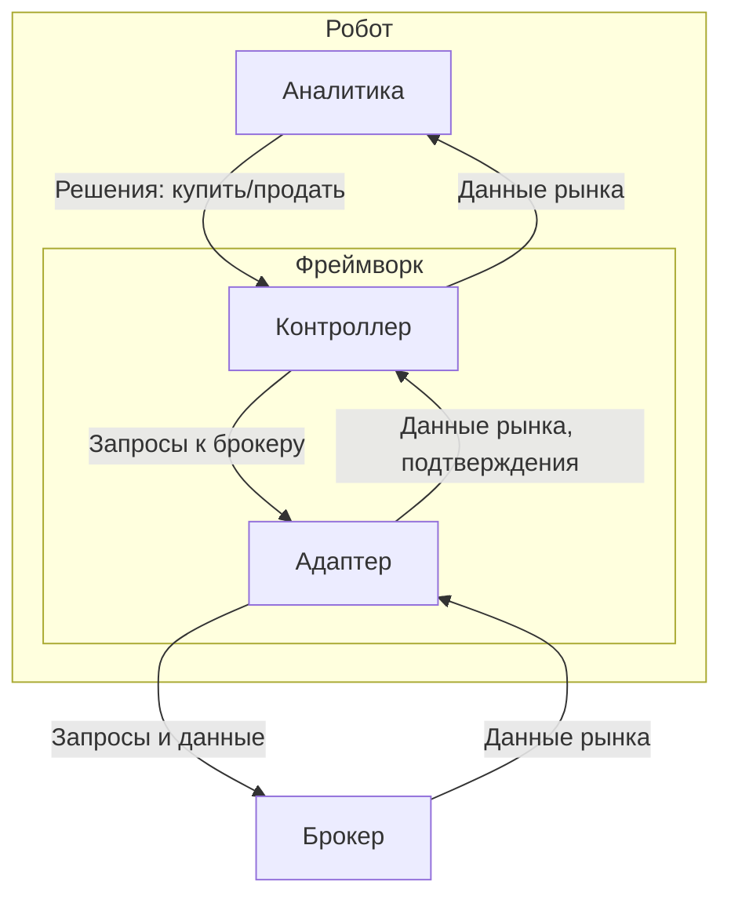
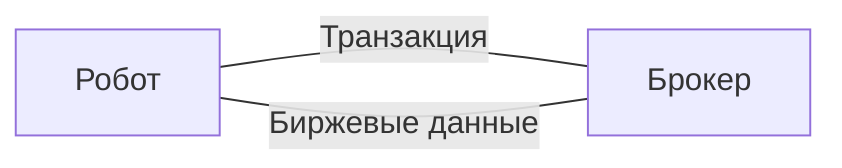
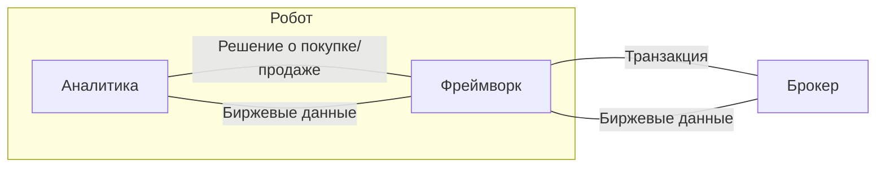
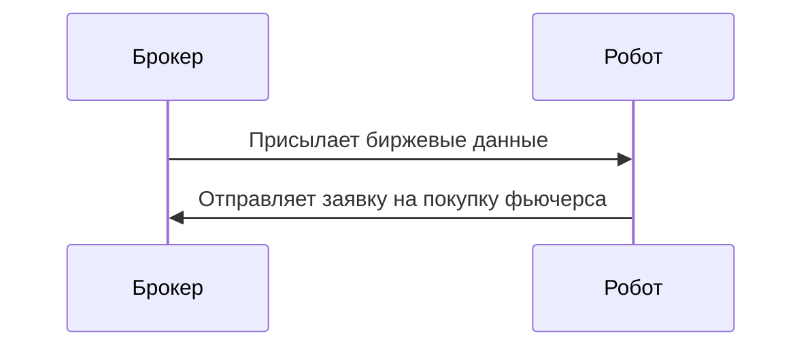
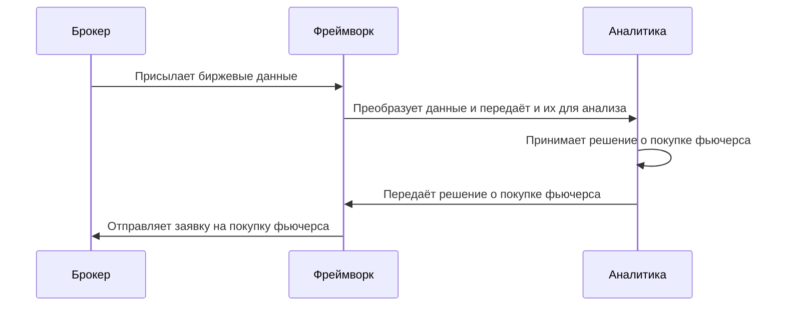

# Концепт робота 
<!-- Перед тем, как ознакомиться с концептом робота, вам нужно понимать следующие термины:
- Аналитика — модуль, отвечающий за реализацию бизнес логики стратегии.  -->

## Что такое робот?
Робот — это программа для автоматизации торговли. 

<!-- **Обратите внимание**, целью данного проекта не является написание самой логики принятия решения о покупке/продаже инструментов! -->
## Архитектура робота
Робот делится на 2 части:
- Аналитика
- Фреймворк

Аналитика — модуль робота, принимающий решение о покупке/продаже инструментов. Аналитика является заменяемым модулем, т.е. могут быть прописаны разные торговые стратегии. 

Фреймворк — модуль робота, выступающий посредником между брокером и аналитикой. При изменении аналитики фреймворк не должен меняться (конечно, если у аналитики не меняются входы/выходы).

Фреймворк также делится на 2 части:
  - Контроллер
  - Адаптер

Контроллер — модуль фреймворка, организующий общение между аналитикой и адаптером. Например, если аналитика решила открыть позицию по инструменту, то контроллер отправит заявку на открытие позиции в адаптер.

Адаптер — модуль фреймворка, отвечающий за соединение с брокером. Эта часть может быть заменена, если поменяется способ обмена данными с брокером (переход на другое API и т.п.).

## Основные задачи робота
- Обеспечить автоматизацию торговли через брокера на основе заданной торговой стратегии.
## Основные задачи фреймворка
- Организация взаимодействия между аналитикой и брокером.
- Обеспечение отказоустойчивости при работе с брокером.

## Функционал робота
- Получение биржевых данных.
- Принятие решений на основе заданной стратегии.
- Исполнение торговых решений через брокера.
- Работа в режиме реального времени.

## Функционал фреймворка
- Обработка биржевых данных, полученных от брокера.
- Передача данных аналитике.
- Преобразование решений аналитики в торговые запросы.
- Восстановление соединения с брокером в случае разрыва.

## Входные/выходные данные робота
На данной диаграмме в общих чертах описано какие данные робот берёт на вход и какие данные производит на выходе:

## Входные/выходные данные фреймворка
На данной диаграмме в общих чертах описано какие данные робот берёт на вход и какие данные производит на выходе:

## Процесс работы робота

## Процесс работы фреймворка

## Технические требования к роботу
- Робот должен быть написан на языке программирования python.
- Фреймворк должен быть спроектирован так, чтобы можно было легко заменить модуль адаптера.
- Робот должен быть отказоустойчивым.
  - Если произошла потеря соединения с брокером, то робот должен его восстанавливать.
  - Если брокер присылает некорректные данные, то робот должен их отфильтровывать.
  - Робот должен сохранять текущее состояние в случае сбоя
- При замене модуля аналитики фреймворк не должен меняться.
