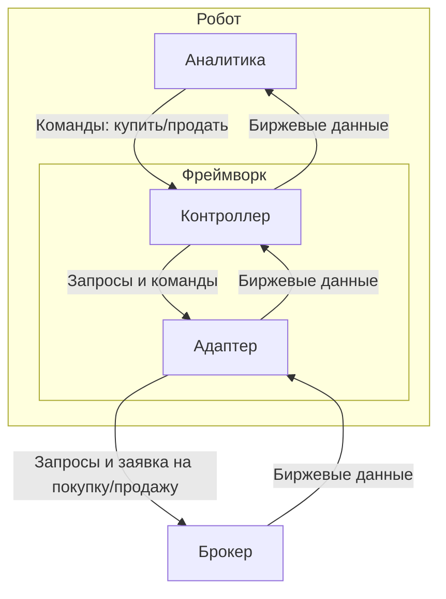
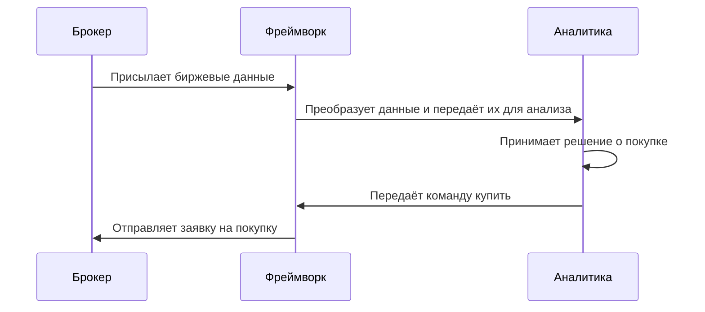

# Концепт робота
`Робот` — программа для автоматизации торговли.

`Робот` делится на 2 части:
- [Аналитика](#аналитика)
- [Фреймворк](#фреймворк)

## Аналитика
`Аналитика` — встраиваемая часть `робота`, отвечающая за принятие решений о покупке/продаже инструментов.

`Аналитика` может меняться вместе со стратегией.

**Целью данного проекта не является написание `аналитики`. `Аналитика` лишь встраивается в `робота`.**

## Фреймворк
`Фреймворк` — часть `робота`, которая позволяет `аналитике` торговать на бирже. 

Т.е. `аналитика` принимает решения о покупке/продаже, а `фреймворк` реализует эти решения через брокера, одновременно предоставляя `аналитике` `биржевые данные`.

Под `биржевыми данными` подразумеваются цены и данные о торговых инструментах.

`Фреймворк` делится на 2 части:
- [Контроллер](#контроллер)
- [Адаптер](#адаптер)

### Контроллер
`Контроллер` — часть `фреймворка`, отвечающая за взаимодействие с `аналитикой`. `Контроллер` передаёт `биржевые данные` от адаптера `аналитике` и команды купить/продать от `аналитики` `адаптеру`  

В отличие от `адаптера` `контроллер` не меняется при смене брокера.

### Адаптер
`Адаптер` — часть `фреймворка`, отвечающая непосредственно за коммуникацию с брокером. `Адаптер` преобразует данные от `контроллера` в формат брокера, а данные от брокера преобразует в формат `контроллера`

`Адаптер` меняется в зависимости от брокера.

### Задачи фреймворка
- Организация взаимодействия между `аналитикой` и брокером.

### Функционал фреймворка
- Обработка `биржевых данных`, полученных от брокера.
- Передача данных от брокера к `аналитике`.
- Передача команд `аналитики` на покупку/продажу брокеру.
### Входные/выходные данные фреймворка

### Процесс работы фреймворка

### Технические требования к фреймворку
- `Фреймворк` должен быть написан на языке программирования python.
- `Фреймворк` должен быть спроектирован так, чтобы при переходе на другого брокера можно было легко заменить модуль `адаптера` без изменений в `контроллере`.
- `Фреймворк` должен быть спроектирован так, чтобы при изменении `аналитики` не было необходимости переделывать `фреймворк`.
