# Логический уровень контроллера
В данном файле описано устройство контроллера на логическом уровне.

Содержание:
- [Логический уровень контроллера](#логический-уровень-контроллера)
  - [Выбор подхода к реализации](#выбор-подхода-к-реализации)
  - [Термины](#термины)
  - [Архитектура контроллера](#архитектура-контроллера)
    - [ИнтерфейсАналитики](#интерфейсаналитики)
    - [ИнтерфейсФреймворка](#интерфейсфреймворка)
    - [Заявки](#заявки)
    - [Фьючерсы](#фьючерсы)
    - [Свечи](#свечи)
    - [Индексы](#индексы)
    - [Сценарии](#сценарии)
    - [ХранилищеБиржевыхДанных](#хранилищебиржевыхданных)
    - [РегуляторПодписок](#регуляторподписок)
  - [Структуры данных](#структуры-данных)
    - [АналитическаяСвеча](#аналитическаясвеча)
    - [АналитическаяЗаявка](#аналитическаязаявка)
    - [АналитическийОтветНаЗаявку](#аналитическийответназаявку)
    - [Фьючерс](#фьючерс)
    - [БиржевыеДанные](#биржевыеданные)

## Выбор подхода к реализации
Фреймворк должен в себе сочетать **ООП** (объектно ориентированное программирование) и **ФП** (функциональное программирование).

ФП позволяет сделать код более читабельным и простым, однако ФП в чистом виде не подходит, т.к. есть необходимость хранить и изменять объекты. Поэтому во фреймворке также должны быть использованы принципы ООП. Однако использовать только ООП тоже неправильно, потому что во многих частях программы ООП будет излишнем и создаст дополнительные сложности.

От ООП берём:
- возможность хранить и изменять объекты

От ФП берём:
- простота
- чистые функции

## Термины
- Позиции — открытые сделки по инструментам
- Аналитические свечи — свечи в формате аналитики.

## Архитектура контроллера

<!-- Общая архитектура робота представляет собой набор из следующих сервисов:
- `Планировщик` — отвечает за запуск всех событий в роботе
- `Свечи` — отвечает за отправку свечей в аналитику в нужном формате
- `Индексы` — отвечает за определение индексов свечей для аналитики
- `Сценарии` — отвечает за определение сценариев свечей
- `Фьючерсы` — отвечает за хранение, обновление информации о текущих фьючерсах
- `Позиции` — отвечает за то, чтобы позиции на бирже соответствовали позициям в аналитике.
- `ХранилищеБиржевыхДанных` — отвечает за хранение и обновление биржевых данных (ГО, Расчётная цена, Стоимость шага)


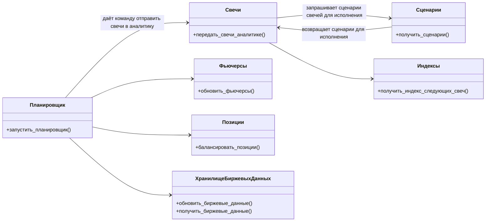
- `ИнтерфейсАналитики` — отвечает за непосредственную передачу данных аналитике -->

### ИнтерфейсАналитики
— модуль, через который фреймворк взаимодействует с аналитикой. 

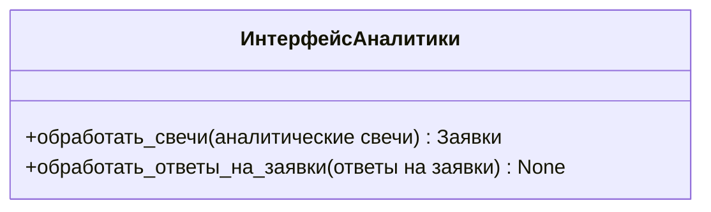

Описание интерфейса:
- +обработать_свечи() — обрабатывает [аналитические свечи](#термины) и на основе них возвращает решение о покупке/продаже тикеров в виде [аналитических заявок](#аналитическаязаявка).
- +обработать_ответы_на_заявки() — обрабатывает [ответы](#аналитическийответназаявку) на отправленные заявки.

То, как происходит работа с интерфейсом, можно посмотреть [здесь](#общий-процесс).

Процесс работы:
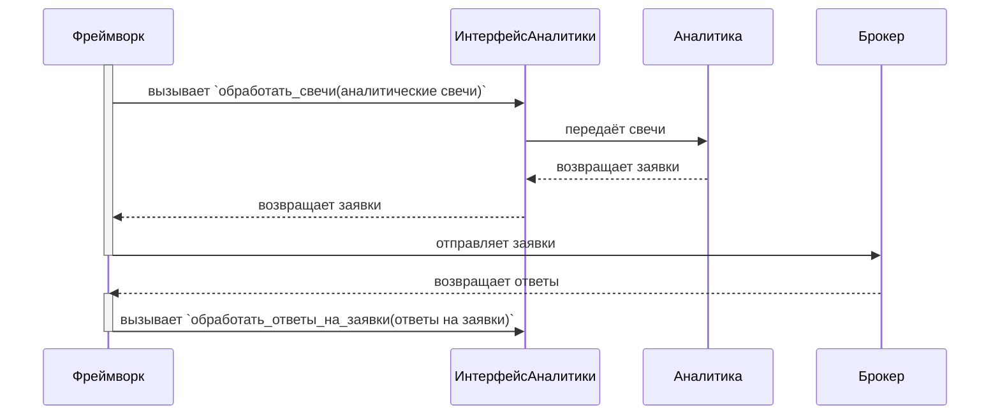
<!-- Как пользоваться интерфейсом?

С помощью обработать_свечи фреймворк отправляет в аналитику свечи и в ответ получает заявки. Фреймворк отправляет эти заявки брокеру. Затем ответы на заявки приходят фреймворку и через обработать_ответы_на_заявки() фреймворк отправляет ответы в аналитику для обработки.


```mermaid
sequenceDiagram
    participant Framework as Фреймворк
    participant Analytics as Аналитика
    participant Broker as Брокер

    activate Framework
    Framework->>Analytics: обработать_свечи(аналитические свечи)
    Analytics->>Framework: возвращает заявки
    Framework->>Broker: отправляет заявки
    deactivate Framework

    Broker->>Framework: возвращает ответы
    Framework->>Analytics: обработать_ответы_на_заявки(ответы на заявки)

``` -->

### ИнтерфейсФреймворка
— модуль, через который аналитика взаимодействует с фреймворком.

```mermaid
classDiagram
  class ИнтерфейсФреймворка{
    +получить_исторические_свечи(тикер, период) исторические свечи
    +получить_стоимость_портфеля() стоимость портфеля
  }

```

Описание интерфейса:
- получить_исторические_свечи() — возвращает массив с ценами закрытий за указанное количество дней.
- получить_стоимость_портфеля() — возвращает текущую стоимость портфеля

Процесс работы:
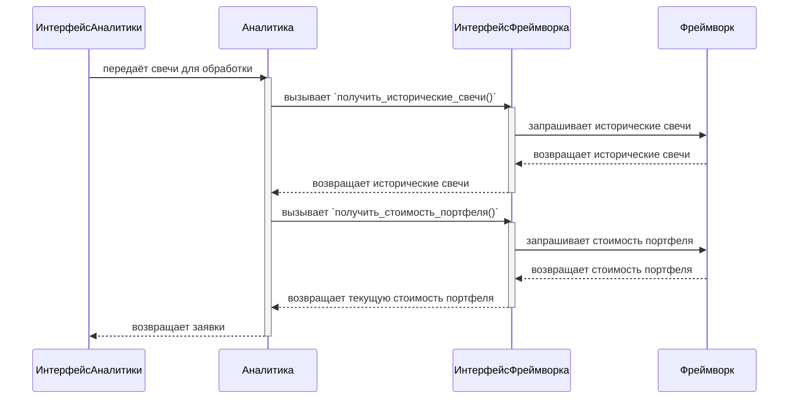

### Заявки
— модуль, отвечающий за отправку заявок из аналитики на биржу.

Ограничения:
- Заявки можно отправлять только в определённое время, поэтому заявка отправленная аналитикой может быть исполнена не сразу
- Если в аналитику отправляется следующая свеча, то на этот момент все отправленные заявки должны быть либо исполнены, либо отклонены.

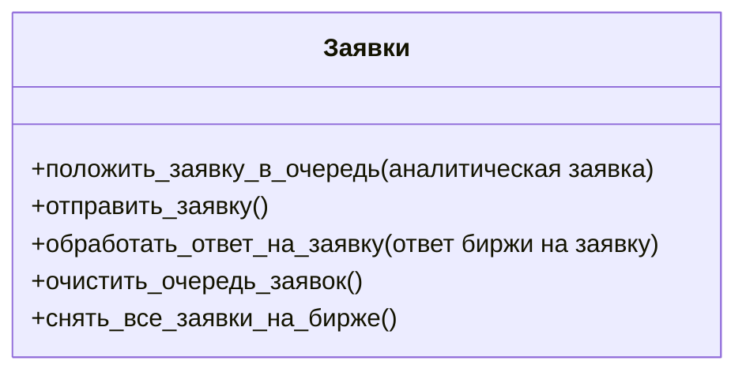

Описание интерфейса:
- положить_заявку_в_очередь() — кладёт [аналитическую заявку](#аналитическаязаявка) в очередь заявок
- отправить_заявки() — если торговля разрешена, то отправляет заявки из очереди заявок на биржу, в ином случае поднимает ошибку
- обработать_ответ_на_заявку() — преобразует ответ биржи на заявку в формат [аналитического ответа на заявку](#аналитическийответназаявку) и передаёт ответ в аналитику.
- очистить_очередь_заявок() — удаляет все заявки из очереди заявок. 
- снять_все_заявки_на_бирже() — снимает все заявки на бирже
<!-- 
Процесс работы:
```mermaid
sequenceDiagram
    participant ИнтерфейсФреймворка
    participant ИнтерфейсАналитики
    participant Планировщик
    participant Заявки
    participant Биржа

    ИнтерфейсФреймворка->>Заявки: вызывает `положить_заявку_в_очередь()`
    Планировщик->>Заявки: вызывает `отправить_заявки()`
    Заявки->>Биржа: отправляет заявки
    Биржа-\->>Заявки: вызывает `обработать_ответ_на_заявку()`
    Заявки->>ИнтерфейсАналитики: передаёт ответы на заявки в формате аналитики
``` 
-->

### Фьючерсы
— модуль, отвечающий за хранение и обновление информации о фьючерсах по тикерам.

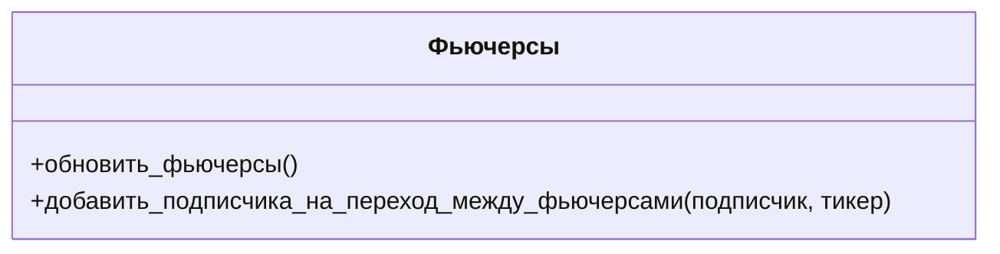

Описание интерфейса:
- обновить_фьючерсы() — обновляет информацию о текущих фьючерсах: если у фьючерса настала дата экспирации, то заменяет его на актуальный фьючерс.
- добавить_подписчика_на_переход_между_фьючерсами() — принимает функцию, которую нужно вызвать после обновления информации о фьючерсе по переданному тикеру.

МОДУЛЬ НЕ ЗАНИМАЕТСЯ ПОДПИСКОЙ НА ПОЛУЧЕНИЕ ЦЕН ПО ФЬЮЧЕРСАМ, только обновление данных.

Процесс работы:
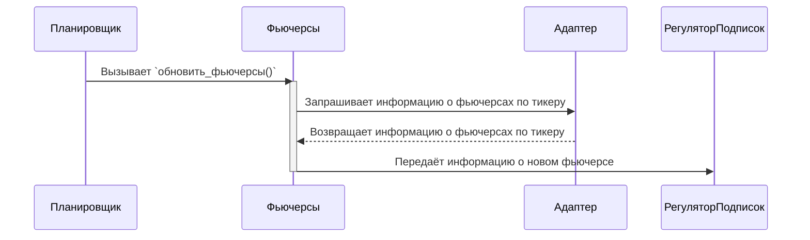

### Свечи
— модуль, отвечающий за создание аналитических свечей и поставку их в аналитику.

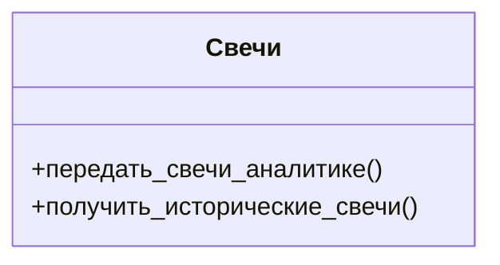

Описание интерфейса:
- передать_свечи_аналитике() — создаёт и отправляет свечи в аналитику.
- получить_исторические_свечи() — возвращает исторические свечи для аналитики.

Процесс работы:
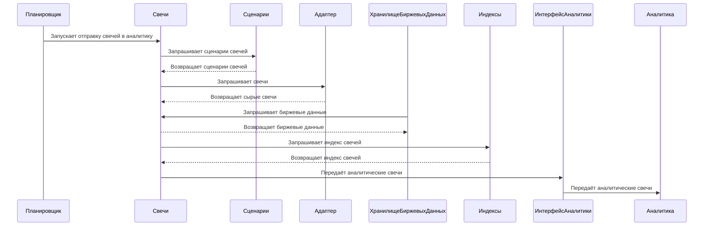
### Индексы
— модуль, отвечающий за индексы свечей, передаваемых в аналитику.

У каждого набора свечей, передаваемых аналитике должен быть свой индекс. Эти индексы должны генерироваться по определённым правилам, которые должен реализовать модуль `Индексы`.

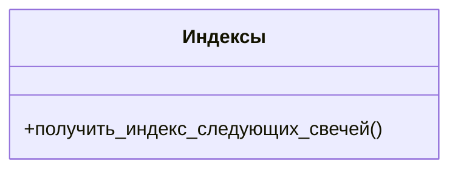

Описание интерфейса:
- получить_индекс_следующих_свечей() — возвращает индекс свечей.


### Сценарии
— модуль, отвечающий за определение сценариев свечей. 

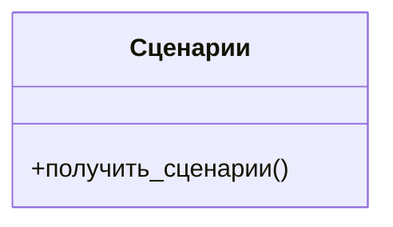

Описание интерфейса:
- получить_сценарии() — возвращает сценарии свечей.


### ХранилищеБиржевыхДанных
— модуль, отвечающий за хранение и обновление биржевых данных. Формат биржевых данных описан [здесь](#биржевыеданные).

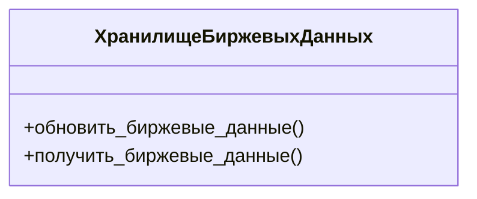
Описание интерфейса:
- обновить_биржевые_данные() — обновляет биржевые данные.
- получить_биржевые_данные() — возвращает биржевые данные. 

### РегуляторПодписок
— модуль, отвечающий за подписки на данные.

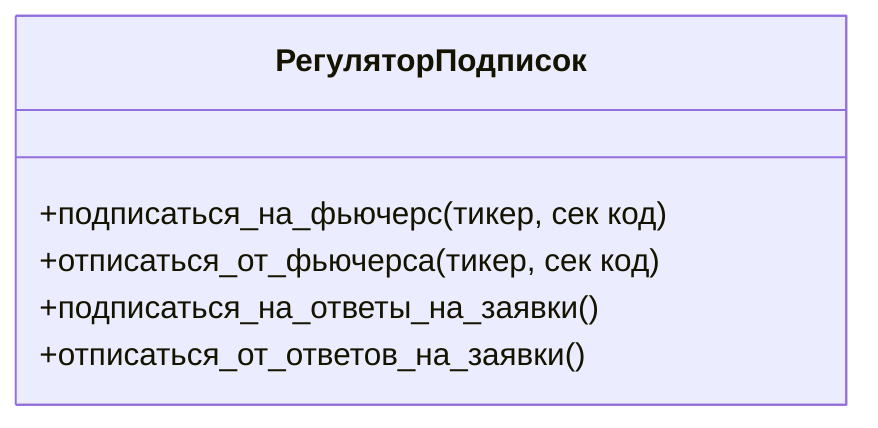

Описание интерфейса:
- подписаться_на_фьючерс() — подписывается на получение цен по фьючерсу
- подписаться_на_ответы_на_заявки() — подписывается на получение ответов на заявки

<!-- 

https://www.umlboard.com/docs/relations/

https://www.ibm.com/docs/en/dmrt/9.5?topic=diagrams-dependency-relationships

 -->
<!-- 
### Планировщик
— модуль, отвечающий за запуск всех событий в роботе

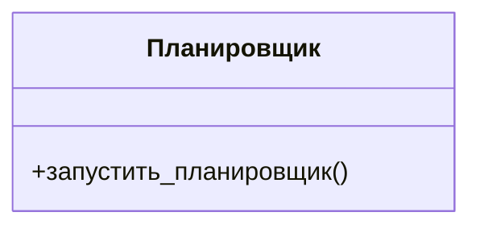

Описание интерфейса:
- запустить_планировщик() — начинает бесконечный цикл, в которым происходят все события в контроллере, включая отправку свечей в аналитику, отправку заявок на биржу и т.д.

### Фьючерсы
— модуль, отвечающий за хранение, обновление информации о текущих фьючерсах.

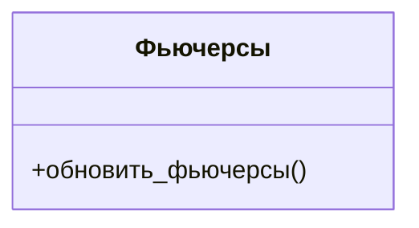

Описание интерфейса:
- обновить_фьючерсы() — обновляет информацию о текущих фьючерсах.

### Позиции
— модуль, отвечающий за то, чтобы позиции на бирже соответствовали позициям в аналитике. 

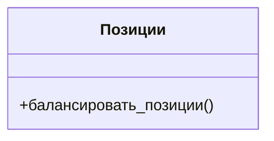
Описание интерфейса:
- балансировать_позиции() — открывает/закрывает позиции на биржи так, чтобы они соответствовали аналитическим позициям.


### ХранилищеБиржевыхДанных
— модуль, отвечающий за хранение и обновление биржевых данных. Формат биржевых данных описан [здесь](#биржевыеданные).


Описание интерфейса:
- обновить_биржевые_данные() — обновляет биржевые данные.
- получить_биржевые_данные() — возвращает биржевые данные. 


-->
<!-- ## Процессы -->

<!-- ### Аналитические свечи
```mermaid
sequenceDiagram
    autonumber
    Планировщик->>Свечи: Запускает отправку свечей в аналитику
    Сценарии->>Свечи: Возвращает сценарии свечей
    Адаптер->>Свечи: Возвращает сырые свечи
    ХранилищеБиржевыхДанных->>Свечи: Возвращает биржевые данные
    Индексы->>Свечи: Возвращает индекс свечей
    Свечи->>ИнтерфейсАналитики: Передаёт аналитические свечи
    ИнтерфейсАналитики->>Аналитика: Передаёт аналитические свечи
    Аналитика->>ИнтерфейсАналитики: Возвращает заявки
    Аналитика->>ИнтерфейсАналитики: Возвращает заявки
``` -->
<!-- ### Отправка заявок

```mermaid
sequenceDiagram
    autonumber
    Аналитика->>Аналитика: Меняет позиции
    Позиции->>Аналитика: Запрашивает позиции
    Позиции->>Адаптер: Отправляет заявки

``` -->
## Структуры данных
### АналитическаяСвеча
| Тип атрибута | Название атрибута | Значение атрибута      |
|--------------|-------------------|------------------------|
| date         | дата              | дата свечи             |
| int          | индекс            | индекс свечи           |
| float        | цена              | цена закрытия свечи    |
| str          | код               | код фьючерса свечи     |
| str          | сценарий          | сценарий               |
| str          | тикер             | тикер                  |
| float        | го                | текущее ГО             |
| float        | расчётная_цена    | текущая расчётная цена |
| float        | стоимость_шага    | текущая стоимость шага |

Атрибут `сценарий` может быть равен:
- NRL — нормальная свеча
- FF — первая свеча фьючерса
- LF — последняя свеча фьючерса
### АналитическаяЗаявка
| Тип атрибута | Название атрибута | Значение атрибута                                       |
|--------------|-------------------|---------------------------------------------------------|
| str          | тикер             | тикер                                                   |
| str          | направление       | направление заявки (либо "B" покупка, либо "S" продажа) |
| int          | количество        | количество лотов в заявке                               |
### АналитическийОтветНаЗаявку
| Тип атрибута | Название атрибута | Значение атрибута                                       |
|--------------|-------------------|---------------------------------------------------------|
| str          | тикер             | тикер                                                   |
| str          | направление       | направление заявки (либо "B" покупка, либо "S" продажа) |
| int          | количество        | количество исполненных лотов                            |
### Фьючерс
Формат, в котором хранится информация о фьючерсе:
| Тип атрибута | Название атрибута | Значение атрибута        |
|--------------|-------------------|--------------------------|
| str          | тикер             | тикер                    |
| str          | код               | код фьючерса             |
| date         | дата_экспирации   | дата экспирации фьючерса |
### БиржевыеДанные
| Тип атрибута | Название атрибута | Значение атрибута |
|--------------|-------------------|-------------------|
| float        | го                | ГО                |
| float        | расчётная_цена    | расчётная цена    |
| float        | стоимость_шага    | стоимость шага    |
