# Логический уровень контроллера
В данном файле описано устройство контроллера на логическом уровне.

Содержание:
- [Логический уровень контроллера](#логический-уровень-контроллера)
  - [Выбор подхода к реализации](#выбор-подхода-к-реализации)
  - [Термины](#термины)
  - [Архитектура контроллера](#архитектура-контроллера)
    - [Планировщик](#планировщик)
    - [Свечи](#свечи)
    - [Индексы](#индексы)
    - [Сценарии](#сценарии)
    - [Фьючерсы](#фьючерсы)
    - [Позиции](#позиции)
    - [ХранилищеБиржевыхДанных](#хранилищебиржевыхданных)
    - [ИнтерфейсАналитики](#интерфейсаналитики)
  - [Процессы](#процессы)
    - [Аналитические свечи](#аналитические-свечи)
    - [Отправка заявок](#отправка-заявок)
  - [Структуры данных](#структуры-данных)
    - [Свеча](#свеча)
    - [Фьючерс](#фьючерс)
    - [БиржевыеДанные](#биржевыеданные)

## Выбор подхода к реализации
Для реализации фреймворка должен быть использован модульный подход. 

Плюсы модульного подхода:
- программу легко поддерживать
- программу легко модифицировать
- программу легко тестировать

## Термины
- Позиции — открытые сделки по инструментам

## Архитектура контроллера
Общая архитектура робота представляет собой набор из следующих сервисов:
- `Планировщик` — отвечает за запуск всех событий в роботе
- `Свечи` — отвечает за отправку свечей в аналитику в нужном формате
- `Индексы` — отвечает за определение индексов свечей для аналитики
- `Сценарии` — отвечает за определение сценариев свечей
- `Фьючерсы` — отвечает за хранение, обновление информации о текущих фьючерсах
- `Позиции` — отвечает за то, чтобы позиции на бирже соответствовали позициям в аналитике.
- `ХранилищеБиржевыхДанных` — отвечает за хранение и обновление биржевых данных (ГО, Расчётная цена, Стоимость шага)
- `ИнтерфейсАналитики` — отвечает за непосредственную передачу данных аналитике

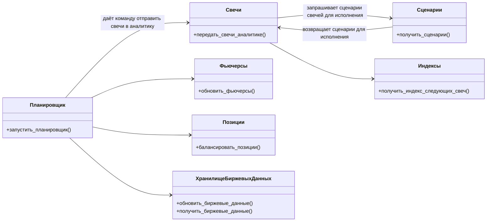
<!-- 

https://www.umlboard.com/docs/relations/

https://www.ibm.com/docs/en/dmrt/9.5?topic=diagrams-dependency-relationships

 -->

### Планировщик
— модуль, отвечающий за запуск всех событий в роботе

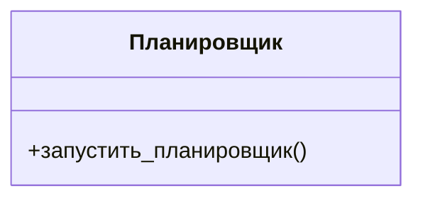

Описание интерфейса:
- запустить_планировщик() — начинает бесконечный цикл, в которым происходят все события в контроллере, включая отправку свечей в аналитику, отправку заявок на биржу и т.д.

### Свечи
— модуль, отвечающий за создание аналитических свечей и поставку их в аналитику. Формат аналитических свечей расписан [здесь](#свеча).

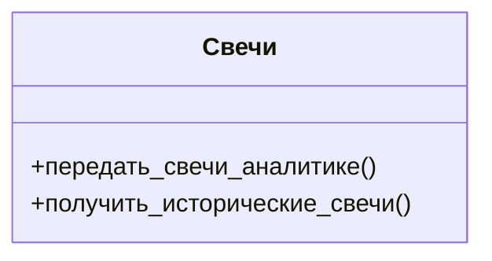

Описание интерфейса:
- передать_свечи_аналитике() — создаёт и отправляет свечи в аналитику.
- получить_исторические_свечи() — возвращает исторические свечи для аналитики.

### Индексы
— модуль, отвечающий за индексы свечей, передаваемых в аналитику.

У каждого набора свечей, передаваемых аналитике должен быть свой индекс. Эти индексы должны генерироваться по определённым правилам, которые должен реализовать модуль `Индексы`.

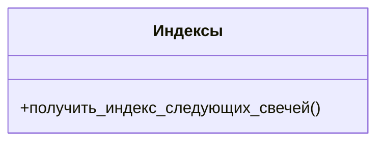

Описание интерфейса:
- получить_индекс_следующих_свечей() — возвращает индексы свечей.

### Сценарии
— модуль, отвечающий за определение сценариев свечей. 

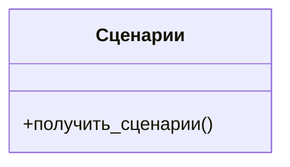

Описание интерфейса:
- получить_сценарии() — возвращает сценарии свечей.

### Фьючерсы
— модуль, отвечающий за хранение, обновление информации о текущих фьючерсах.

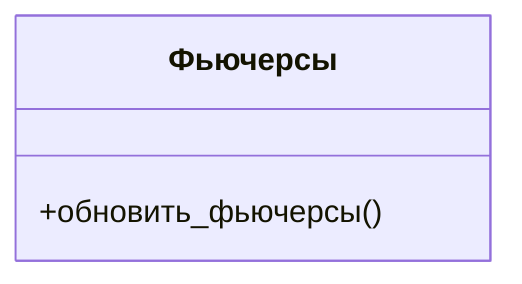

Описание интерфейса:
- обновить_фьючерсы() — обновляет информацию о текущих фьючерсах.

### Позиции
— модуль, отвечающий за то, чтобы позиции на бирже соответствовали позициям в аналитике. 

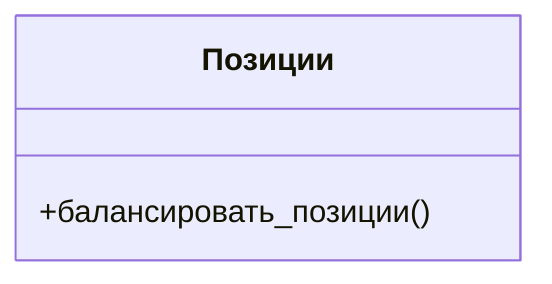
Описание интерфейса:
- балансировать_позиции() — открывает/закрывает позиции на биржи так, чтобы они соответствовали аналитическим позициям.

### ХранилищеБиржевыхДанных
— модуль, отвечающий за хранение и обновление биржевых данных. Формат биржевых данных описан [здесь](#биржевыеданные).

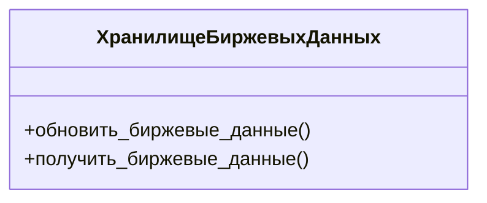
Описание интерфейса:
- обновить_биржевые_данные() — обновляет биржевые данные.
- получить_биржевые_данные() — возвращает биржевые данные.

### ИнтерфейсАналитики
— модуль, отвечающий за передачу данных аналитике.

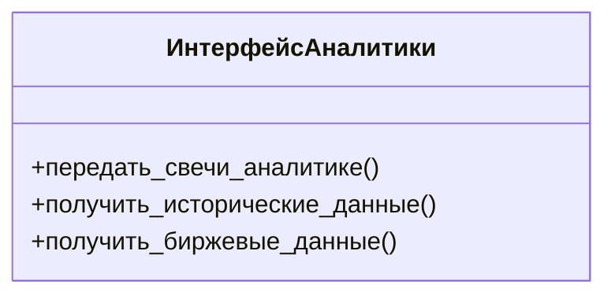
Описание интерфейса:
- передать_свечи_аналитике() — передаёт исторические данные из контроллера аналитике.
- получить_исторические_данные() — возвращает исторические данные из контроллера аналитике.
- получить_капитал() — возвращает состояние счёта из адаптера аналитике.

## Процессы
### Аналитические свечи
Аналитика должна регулярно получать свечи в определённом [формате](#свеча). 

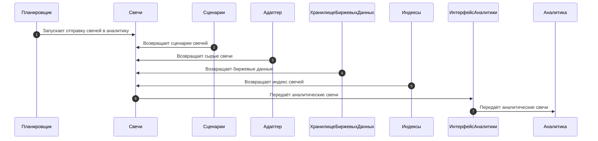
### Отправка заявок

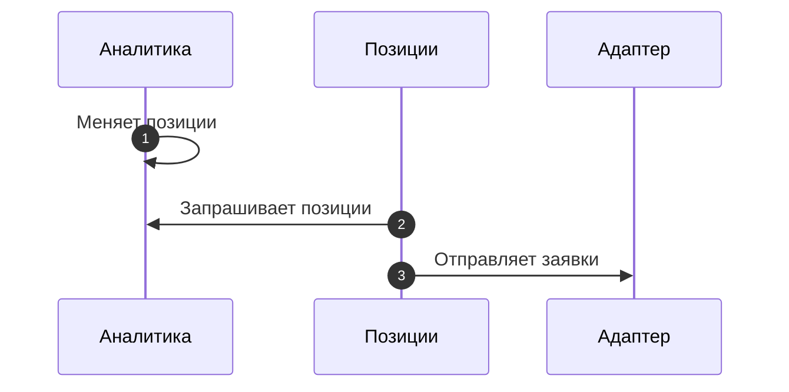
## Структуры данных
### Свеча
| Тип атрибута | Название атрибута | Значение атрибута      |
|--------------|-------------------|------------------------|
| date         | дата              | дата свечи             |
| int          | индекс            | индекс свечи           |
| float        | цена              | цена закрытия свечи    |
| str          | код               | код фьючерса свечи     |
| str          | сценарий          | сценарий               |
| str          | тикер             | тикер                  |
| float        | го                | текущее ГО             |
| float        | расчётная_цена    | текущая расчётная цена |
| float        | стоимость_шага    | текущая стоимость шага |

Атрибут `сценарий` может быть равен:
- NRL — нормальная свеча
- FF — первая свеча фьючерса
- LF — последняя свеча фьючерса
### Фьючерс
| Тип атрибута | Название атрибута | Значение атрибута        |
|--------------|-------------------|--------------------------|
| str          | тикер             | тикер                    |
| str          | код               | код фьючерса             |
| date         | дата_экспирации   | дата экспирации фьючерса |
### БиржевыеДанные
| Тип атрибута | Название атрибута | Значение атрибута |
|--------------|-------------------|-------------------|
| float        | го                | ГО                |
| float        | расчётная_цена    | расчётная цена    |
| float        | стоимость_шага    | стоимость шага    |
