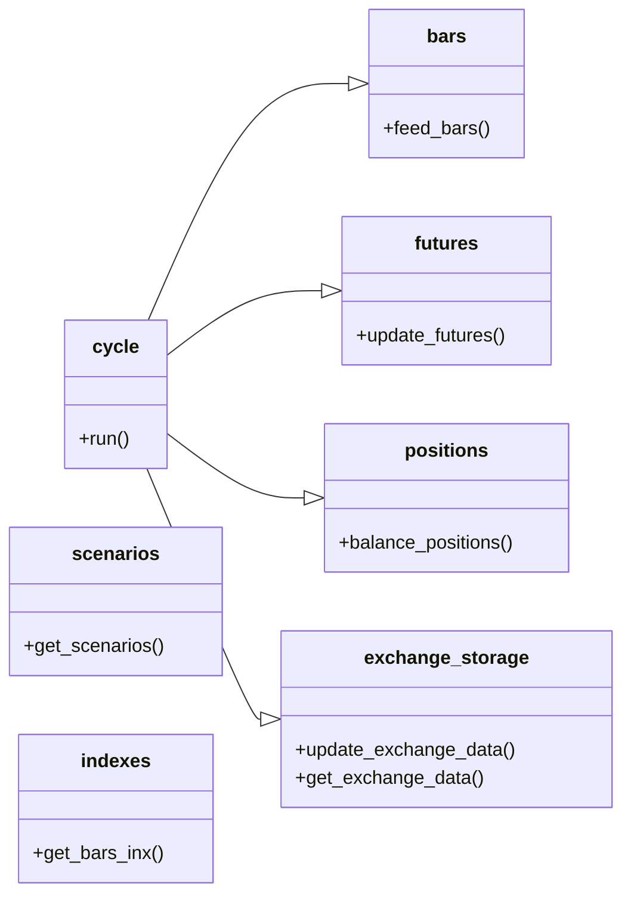
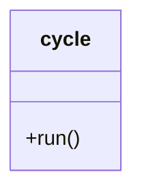
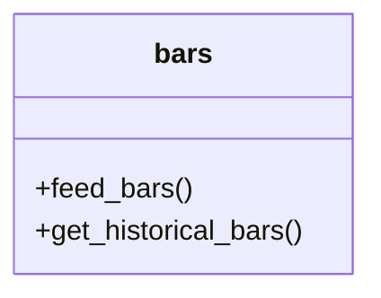
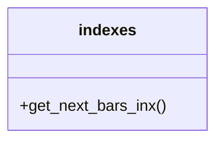
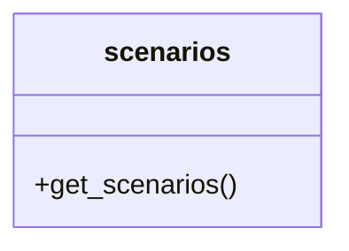
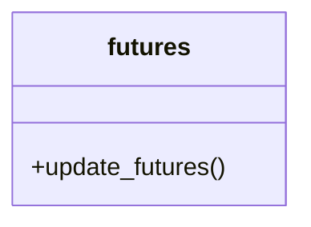
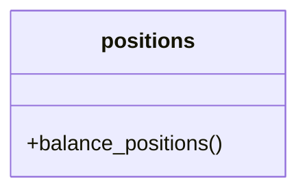
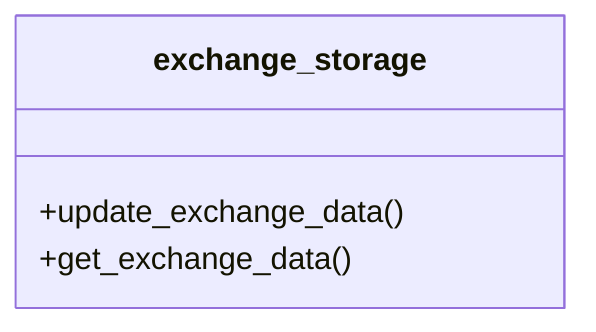
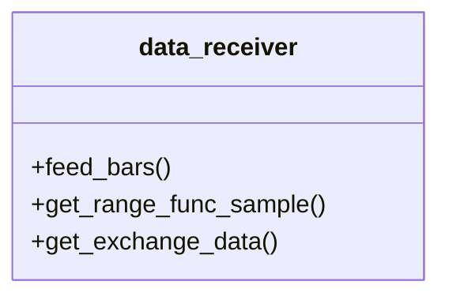
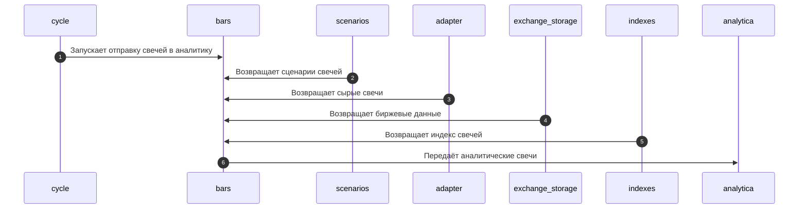

# Логический уровень контроллера
В данном файле описано устройство контроллера на логическом уровне.

Содержание:
- [Логический уровень контроллера](#логический-уровень-контроллера)
- [Выбор подхода к реализации](#выбор-подхода-к-реализации)
- [Термины](#термины)
- [Архитектура контроллера](#архитектура-контроллера)
  - [cycle](#cycle)
  - [bars](#bars)
  - [indexes](#indexes)
  - [scenarios](#scenarios)
  - [futures](#futures)
  - [positions](#positions)
  - [exchange\_storage](#exchange_storage)
  - [data\_receiver](#data_receiver)
- [Процессы](#процессы)
  - [Аналитические свечи](#аналитические-свечи)
  - [Отправка заявок](#отправка-заявок)
- [Структуры данных](#структуры-данных)
  - [Bar](#bar)
  - [Future](#future)
  - [ExchangeData](#exchangedata)

# Выбор подхода к реализации
Для реализации фреймворка должен быть использован модульный подход. 

Плюсы микро модульного подхода:
- программу легко поддерживать
- программу легко модифицировать
- программу легко тестировать

# Термины
- Позиции — открытые сделки по инструментам

# Архитектура контроллера
Общая архитектура робота представляет собой набор из следующих сервисов:
- cycle — отвечает за запуск всех событий в роботе
- bars — отвечает за отправку свечей в аналитику в нужном формате
- indexes — отвечает за определение индексов свечей для аналитики
- scenarios — отвечает за определение сценариев свечей
- futures — отвечает за хранение, обновление информации о текущих фьючерсах
- positions — отвечает за то, чтобы позиции на бирже соответствовали позициям в аналитике.
- exchange_storage — отвечает за хранение и обновление биржевых данных (ГО, Расчётная цена, Стоимость шага)
- data_receiver — отвечает за непосредственную передачу данных аналитике

## cycle
— модуль, отвечающий за запуск всех событий в роботе

Описание интерфейса:
- run() — начинает бесконечный цикл, в которым происходят все события в контроллере, включая отправку свечей в аналитику, отправку заявок на биржу и т.д.

## bars
— модуль, отвечающий за создание аналитических свечей и поставку их в аналитику. Формат аналитических свечей расписан [здесь](#bar).

Описание интерфейса:
- feed_bars() — создаёт и отправляет свечи в аналитику.
- get_historical_bars() — возвращает исторические свечи для аналитики.

## indexes
— модуль, отвечающий за индексы свечей, передаваемых в аналитику.

У каждого набора свечей, передаваемых аналитике должен быть свой индекс. Эти индексы должны генерироваться по определённым правилам, которые должен реализовать модуль `indexes`.

Описание интерфейса:
- get_next_bars_inx() — возвращает индексы свечей.

## scenarios
— модуль, отвечающий за определение сценариев свечей. 

Описание интерфейса:
- get_scenarios() — возвращает сценарии свечей.

## futures
— модуль, отвечающий за хранение, обновление информации о текущих фьючерсах.

Описание интерфейса:
- update_futures() — обновляет информацию о текущих фьючерсах.

## positions
— модуль, отвечающий за то, чтобы позиции на бирже соответствовали позициям в аналитике. 

Описание интерфейса:
- balance_positions() — открывает/закрывает позиции на биржи так, чтобы они соответствовали аналитическим позициям.

## exchange_storage
— модуль, отвечающий за хранение и обновление биржевых данных. Формат биржевых данных описан [здесь](#exchangedata).

Описание интерфейса:
- update_exchange_data() — обновляет биржевые данные.
- get_exchange_data() — возвращает биржевые данные.

## data_receiver
— модуль, отвечающий за передачу данных аналитике.

Описание интерфейса:
- feed_bars() — передаёт исторические данные из контроллера аналитике.
- get_range_func_sample() — возвращает исторические данные из контроллера аналитике.
- get_capital() — возвращает состояние счёта из адаптера аналитике.

# Процессы
## Аналитические свечи
Аналитика должна регулярно получать свечи в определённом [формате](#bar). 

## Отправка заявок

# Структуры данных
## Bar
| Тип атрибута | Название атрибута | Значение атрибута      |
|--------------|-------------------|------------------------|
| date         | date              | дата свечи             |
| int          | inx               | индекс свечи           |
| float        | close             | цена закрытия свечи    |
| str          | code              | код фьючерса свечи     |
| str          | scenario          | сценарий               |
| str          | ticker            | тикер                  |
| float        | go                | текущее ГО             |
| float        | settle_price      | текущая расчётная цена |
| float        | step_cost         | текущая стоимость шага |

Атрибут scenario может быть равен:
- NRL — нормальная свеча
- FF — первая свеча фьючерса
- LF — последняя свеча фьючерса

## Future
| Тип атрибута | Название атрибута | Значение атрибута        |
|--------------|-------------------|--------------------------|
| str          | ticker            | тикер                    |
| str          | code              | код фьючерса             |
| date         | exp_date          | дата экспирации фьючерса |
## ExchangeData
| Тип атрибута | Название атрибута | Значение атрибута |
|--------------|-------------------|-------------------|
| float        | go                | ГО                |
| float        | settle_price      | расчётная цена    |
| float        | step_cost         | стоимость шага    |
