# Логический уровень робота
В данном файле описано устройство робота на логическом уровне.

Содержание:
- [Логический уровень робота](#логический-уровень-робота)
  - [Выбор подхода к реализации](#выбор-подхода-к-реализации)
  - [Термины](#термины)
  - [Общий обзор](#общий-обзор)
  - [Архитектура робота](#архитектура-робота)
    - [Планировщик](#планировщик)
    - [ИнтерфейсАналитики](#интерфейсаналитики)
    - [ИнтерфейсФреймворка](#интерфейсфреймворка)
    - [Заявки](#заявки)
    - [Фьючерсы](#фьючерсы)
    - [Свечи](#свечи)
    - [Индексы](#индексы)
    - [Сценарии](#сценарии)
    - [ХранилищеБиржевыхДанных](#хранилищебиржевыхданных)
    - [РегуляторПодписок](#регуляторподписок)
    - [Адаптер](#адаптер)
  - [Структуры данных](#структуры-данных)
    - [АналитическаяСвеча](#аналитическаясвеча)
    - [АналитическаяЗаявка](#аналитическаязаявка)
    - [АналитическийОтветНаЗаявку](#аналитическийответназаявку)
    - [Фьючерс](#фьючерс)
    - [БиржевыеДанные](#биржевыеданные)

## Выбор подхода к реализации
Фреймворк должен в себе сочетать **ООП** (объектно ориентированное программирование) и **ФП** (функциональное программирование).

ФП позволяет сделать код более читабельным и простым, однако ФП в чистом виде не подходит, т.к. есть необходимость хранить и изменять объекты. Поэтому во фреймворке также должны быть использованы принципы ООП. Однако использовать только ООП тоже неправильно, потому что во многих частях программы ООП будет излишнем и создаст дополнительные сложности.

От ООП берём:
- возможность хранить и изменять объекты

От ФП берём:
- простота
- чистые функции

## Термины
- Позиции — открытые сделки по инструментам
- Аналитические свечи — свечи в [формате аналитики](#аналитическаясвеча).

## Общий обзор
- Робот делится на две составляющие: Аналитика и Фреймворк.
- Аналитика — встраиваемая часть робота, отвечающая за принятие решений об отправке заявок.
  - В данном документе не рассматриваются детали устройства Аналитики, только её вход и выход, т.к. Аналитика лишь встраивается в робота, к тому же она пишется другим разработчиком. 
- Фреймворк — часть робота, позволяющая Аналитике торговать на бирже.

Общий процесс можно представить так:
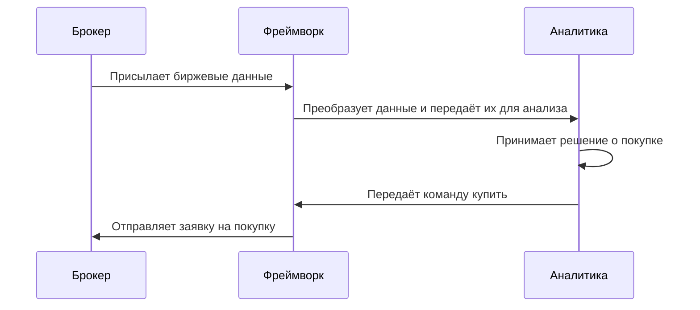

## Архитектура робота
В данной секции будут описаны модули Робота. В каждом описании можно найти:
- описания функций модуля для внешнего использования.
- описание того, как модуль взаимодействует с другими модулями, через процессы. В этих описаниях опущены детали работы других модулей и основная концентрация идёт на описываемый модуль.

### Планировщик
— центральный модуль программы, который вызывает функции, которые требуется вызывать регулярно (функции можно увидеть далее).

**Функции для регулярного запуска (сами функции будут описаны далее в следующих секциях):**
- Фьючерсы.обновить_фьючерсы()
- Свечи.передать_свечи_аналитике()
- Заявки.отправить_заявки()
- ХранилищеБиржевыхДанных.обновить_биржевые_данные()

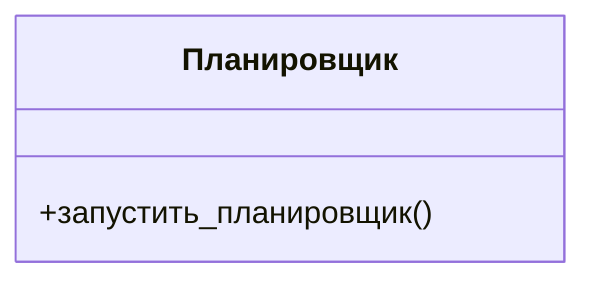

Публичные функции:
- запустить_планировщик() — запускает бесконечный цикл, в котором вызываются функции для регулярного запуска (функции перечислены чуть выше)

Процесс работы:
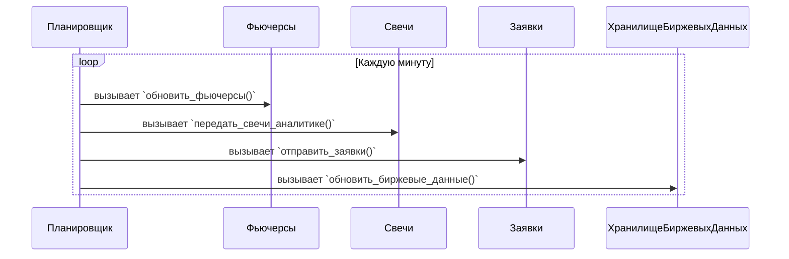

### ИнтерфейсАналитики
— модуль, через который фреймворк взаимодействует с аналитикой. 

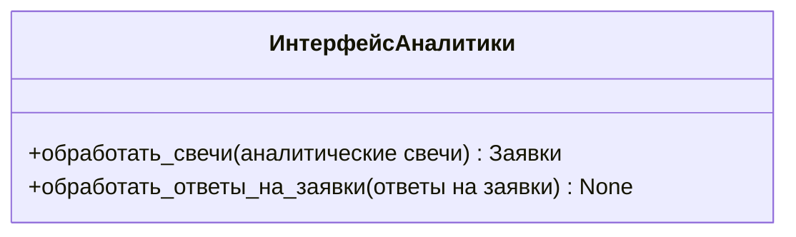

Описание функций для внешнего использования:
- +обработать_свечи() — обрабатывает [аналитические свечи](#термины) и на основе них возвращает решение о покупке/продаже в виде [аналитических заявок](#аналитическаязаявка).
- +обработать_ответы_на_заявки() — обрабатывает [ответы](#аналитическийответназаявку) на отправленные заявки.

То, как происходит работа с интерфейсом, можно посмотреть [здесь](#общий-процесс).

Процесс работы:
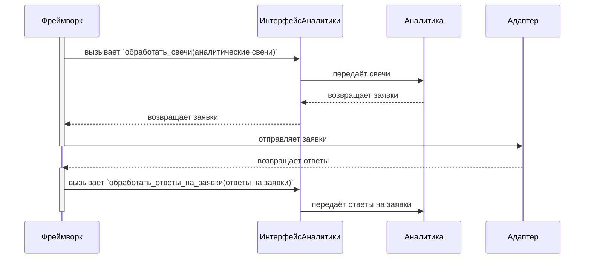

### ИнтерфейсФреймворка
— модуль, через который аналитика взаимодействует с фреймворком.

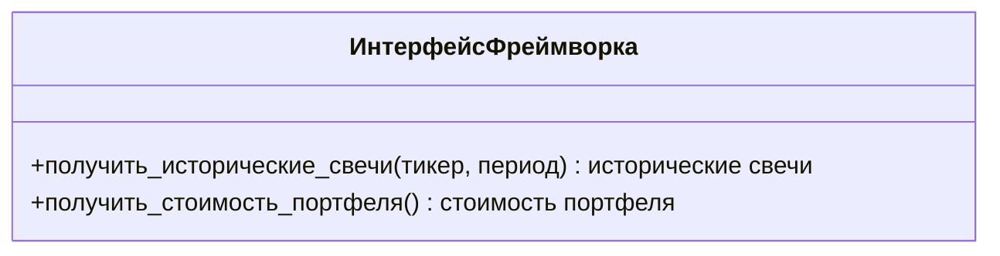

Описание функций для внешнего использования:
- получить_исторические_свечи() — возвращает массив с ценами закрытий за указанное количество дней.
- получить_стоимость_портфеля() — возвращает текущую стоимость портфеля

Процесс работы:
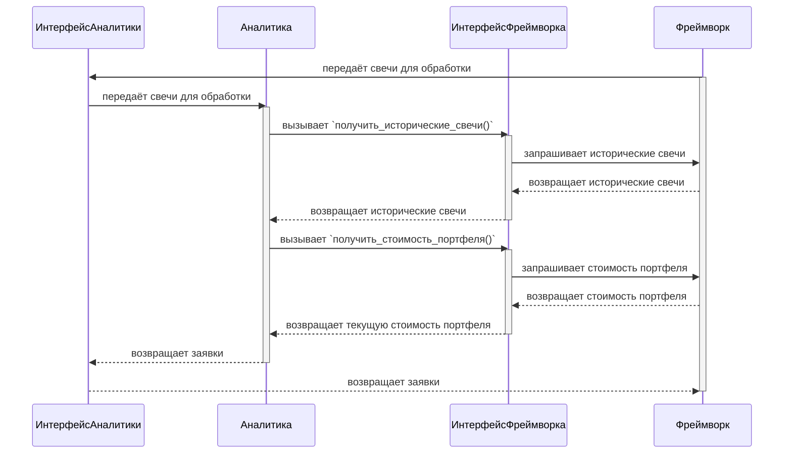

### Заявки
— модуль, отвечающий за отправку заявок из аналитики на биржу.

Ограничения:
- Заявки можно отправлять только в определённое время, поэтому заявка отправленная аналитикой может быть исполнена не сразу
- Если в аналитику отправляется следующая свеча, то на этот момент все отправленные заявки должны быть либо исполнены, либо отклонены.

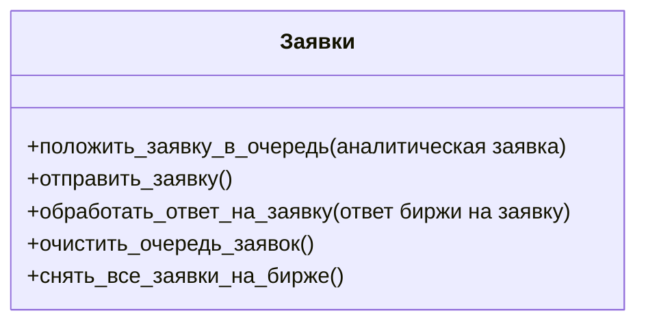

Описание функций для внешнего использования:
- положить_заявку_в_очередь() — кладёт [аналитическую заявку](#аналитическаязаявка) в очередь заявок
- отправить_заявки() — если торговля разрешена, то отправляет заявки из очереди заявок на биржу, в ином случае поднимает ошибку
- обработать_ответ_на_заявку() — преобразует ответ биржи на заявку в формат [аналитического ответа на заявку](#аналитическийответназаявку) и передаёт ответ в аналитику.
- очистить_очередь_заявок() — удаляет все заявки из очереди заявок. 
- снять_все_заявки_на_бирже() — снимает все заявки на бирже

Процесс работы:
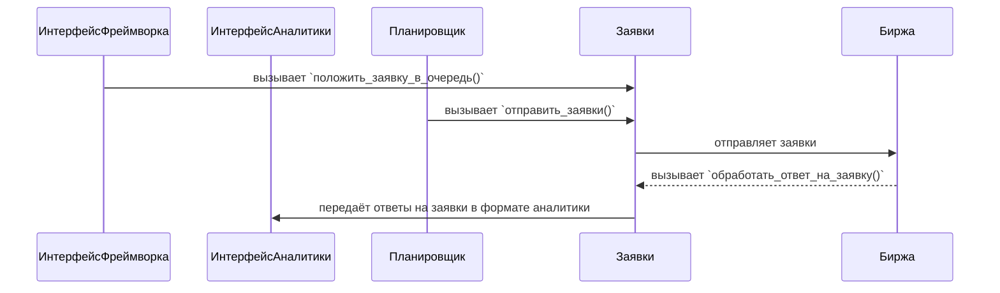

### Фьючерсы
— модуль, отвечающий за хранение и обновление информации о фьючерсах по тикерам.

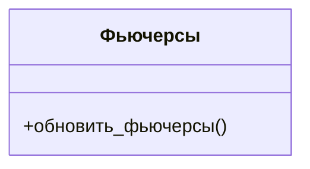

Описание функций для внешнего использования:
- обновить_фьючерсы() — обновляет информацию о текущих фьючерсах: если у фьючерса настала дата экспирации, то заменяет его на актуальный фьючерс.

Процесс работы:
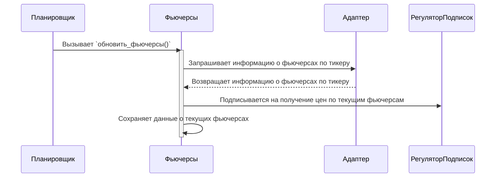

### Свечи
— модуль, отвечающий за создание аналитических свечей и поставку их в аналитику.

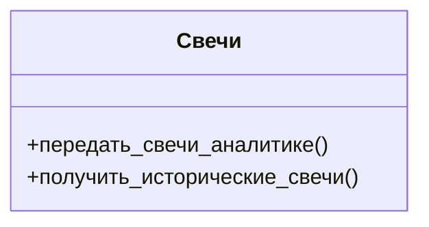

Описание функций для внешнего использования:
- передать_свечи_аналитике() — создаёт и отправляет свечи в аналитику.
- получить_исторические_свечи() — возвращает исторические свечи для аналитики.

Процесс работы:
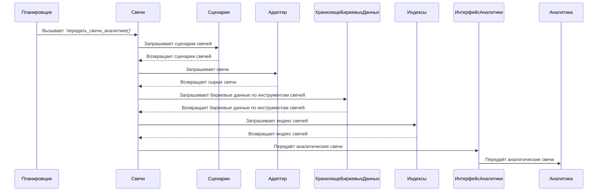
### Индексы
— модуль, отвечающий за индексы свечей, передаваемых в аналитику.

Индекс — атрибут [аналитической свечи](#аналитическаясвеча), идентифицирующий её среди других свечей по тикеру.

Перед отправкой свечей в `Аналитику` каждой свече должен быть присвоен определённый индекс.

Требования:
- В `Аналитику` свечи отправляются наборами. В каждом наборе находятся свечи по всем отслеживаемым инструментам. **У всех свечей в** таком **наборе** должен быть **одинаковый индекс**.
- **Индекс может только увеличиваться**. Т.е. если в аналитику передана свеча с индексом 100, то в следующий индекс должен быть больше 100.

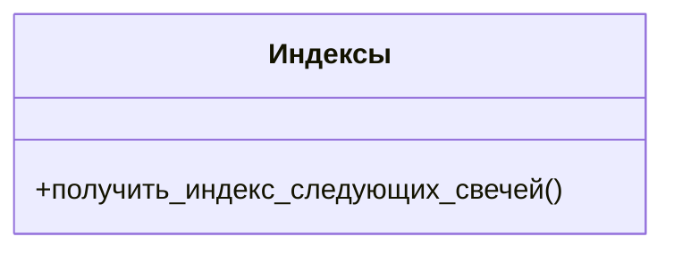

Описание функций для внешнего использования:
- получить_индекс_следующих_свечей() — возвращает индекс свечей.

Процесс работы:
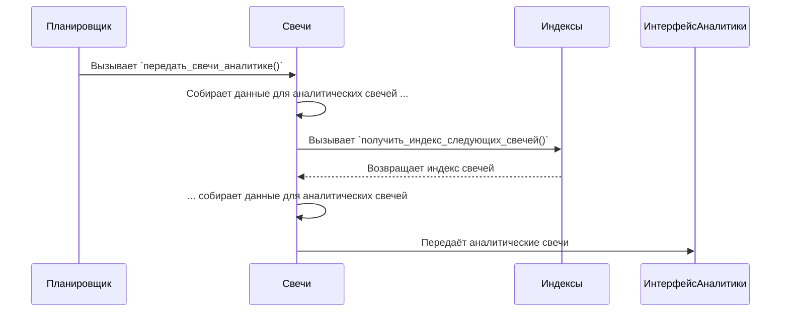

### Сценарии
— модуль, отвечающий за определение сценариев свечей. 

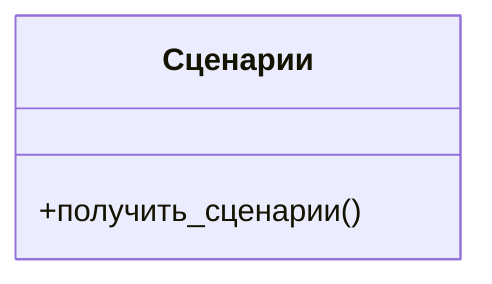

Описание функций для внешнего использования:
- получить_сценарии() — возвращает сценарии свечей.

Процесс работы:

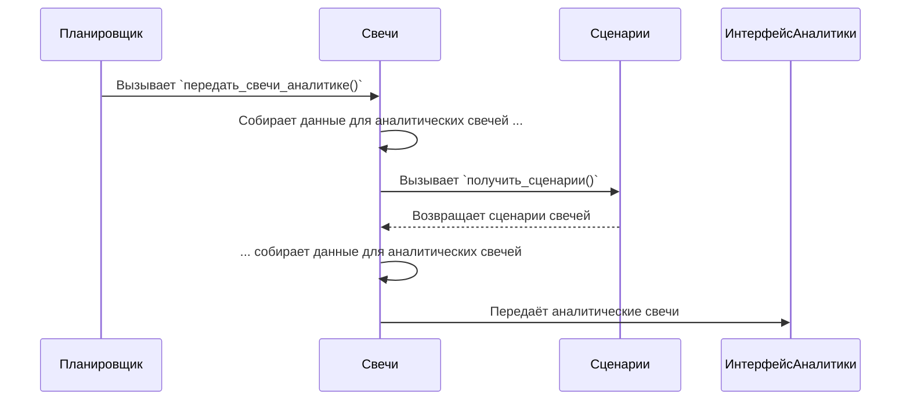

### ХранилищеБиржевыхДанных
— модуль, отвечающий за хранение и обновление биржевых данных. Формат биржевых данных описан [здесь](#биржевыеданные).

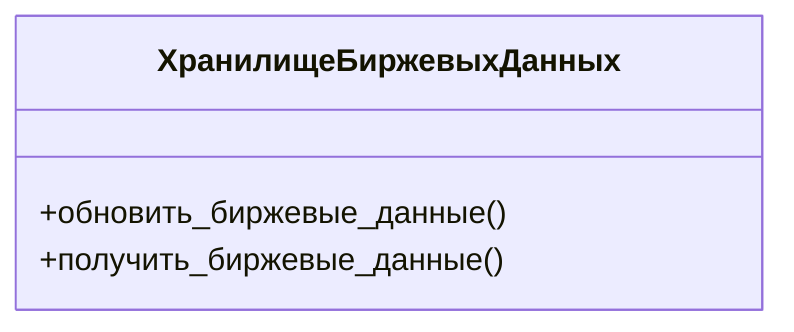
Описание функций для внешнего использования:
- обновить_биржевые_данные() — обновляет биржевые данные.
- получить_биржевые_данные() — возвращает биржевые данные. 

Процесс работы:
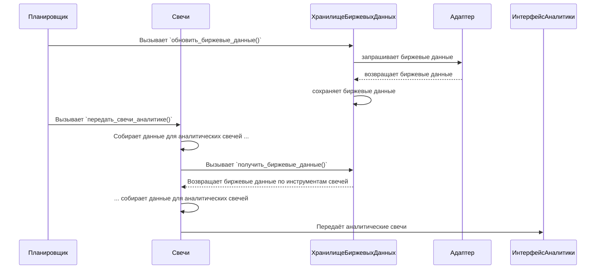
### РегуляторПодписок
— модуль, отвечающий за подписки на данные.

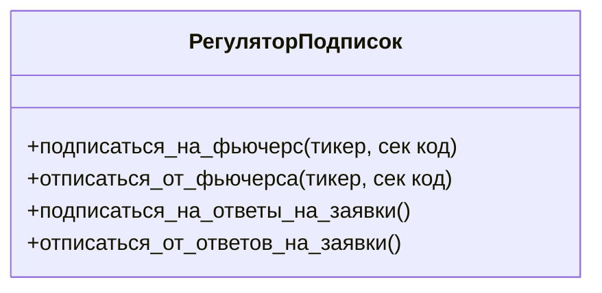

Описание функций для внешнего использования:
- подписаться_на_фьючерс() — подписывается на получение цен по фьючерсу
- отписаться_от_фьючерса() — отписывается от получения цен по фьючерсу
- подписаться_на_ответы_на_заявки() — подписывается на получение ответов на заявки
- отписаться_от_ответов_на_заявки() — отписывается от получения ответов на заявки

Процесс работы:
```mermaid
sequenceDiagram
  Планировщик->>Фьючерсы: Вызывает `обновить_фьючерсы()`
  activate Фьючерсы
  Фьючерсы->>Фьючерсы: Получает данные о текущих фьючерсах
  Фьючерсы->>РегуляторПодписок: Подписывается на получение цен по текущим фьючерсам
  РегуляторПодписок->>Адаптер: Отправляет запрос на подписку на цены фьючерсов
  Адаптер-->>РегуляторПодписок: Присылает подтверждение подписки
  Фьючерсы->>Фьючерсы: Сохраняет данные о текущих фьючерсах
  deactivate Фьючерсы
```

### Адаптер
— модуль отвечающий за коммуникацию с биржей. Он преобразует данные из биржи в формат, нужный аналитике, а данные от аналитики в формат биржи.


```mermaid
classDiagram
  class Адаптер{
    +подписаться_на_фьючерс(тикер, сек код)
    +отписаться_от_фьючерса(тикер, сек код)
    +подписаться_на_ответы_на_заявки()
    +отписаться_от_ответов_на_заявки()
    +получить_все_коллбеки()
    +получить_текущие_позиции() dict[код_фьючерса: количество_позиций]
    +отправить_заявку(аналитическая_заявка) 
    +получить_го(код_фьючерса) го
    +получить_стоимость_шага(код_фьючерса) стоимость_шага
    +можно_ли_сейчас_торговать(код_фьючерса) True/False
    +получить_стоимость_портфеля() стоимость_портфеля
    +получить_информацию_о_фьючерсах(тикер) информация_о_фьючерсах
  }
```

## Структуры данных
### АналитическаяСвеча
— формат свечи для отправки в `Аналитику`.

| Тип атрибута | Название атрибута | Значение атрибута                                                |
|--------------|-------------------|------------------------------------------------------------------|
| date         | дата              | дата свечи                                                       |
| int          | индекс            | число, идентифицирующее свечу среди других свечей по тикеру      |
| float        | цена              | цена закрытия свечи                                              |
| str          | код               | код фьючерса свечи                                               |
| str          | сценарий          | сценарий                                                         |
| str          | тикер             | тикер                                                            |
| float        | го                | текущее ГО                                                       |
| float        | расчётная_цена    | текущая расчётная цена                                           |
| float        | стоимость_шага    | текущая стоимость шага                                           |

Атрибут `сценарий` может быть равен:
- NRL — нормальная свеча
- FF — первая свеча фьючерса
- LF — последняя свеча фьючерса
### АналитическаяЗаявка
| Тип атрибута | Название атрибута | Значение атрибута                                       |
|--------------|-------------------|---------------------------------------------------------|
| str          | тикер             | тикер                                                   |
| str          | направление       | направление заявки (либо "B" покупка, либо "S" продажа) |
| int          | количество        | количество лотов в заявке                               |
### АналитическийОтветНаЗаявку
| Тип атрибута | Название атрибута | Значение атрибута                                       |
|--------------|-------------------|---------------------------------------------------------|
| str          | тикер             | тикер                                                   |
| str          | направление       | направление заявки (либо "B" покупка, либо "S" продажа) |
| int          | количество        | количество исполненных лотов                            |
### Фьючерс
Формат, в котором хранится информация о фьючерсе:
| Тип атрибута | Название атрибута | Значение атрибута        |
|--------------|-------------------|--------------------------|
| str          | тикер             | тикер                    |
| str          | код               | код фьючерса             |
| date         | дата_экспирации   | дата экспирации фьючерса |
### БиржевыеДанные
| Тип атрибута | Название атрибута | Значение атрибута |
|--------------|-------------------|-------------------|
| float        | го                | ГО                |
| float        | расчётная_цена    | расчётная цена    |
| float        | стоимость_шага    | стоимость шага    |
