# Логический уровень робота
В данном файле описано устройство робота на логическом уровне.

Содержание:
- [Логический уровень робота](#логический-уровень-робота)
  - [Выбор подхода к реализации](#выбор-подхода-к-реализации)
  - [Термины](#термины)
  - [Общий обзор](#общий-обзор)
  - [Архитектура робота](#архитектура-робота)
    - [Планировщик](#планировщик)
    - [ИнтерфейсАналитики](#интерфейсаналитики)
    - [ИнтерфейсФреймворка](#интерфейсфреймворка)
    - [Заявки](#заявки)
    - [Фьючерсы](#фьючерсы)
    - [Свечи](#свечи)
    - [Индексы](#индексы)
    - [Сценарии](#сценарии)
    - [ХранилищеБиржевыхДанных](#хранилищебиржевыхданных)
    - [РегуляторПодписок](#регуляторподписок)
    - [Адаптер](#адаптер)
  - [Структуры данных](#структуры-данных)
    - [СыраяСвеча](#сыраясвеча)
    - [АналитическаяСвеча](#аналитическаясвеча)
    - [АналитическаяЗаявка](#аналитическаязаявка)
    - [АналитическийОтветНаЗаявку](#аналитическийответназаявку)
    - [Фьючерс](#фьючерс)
    - [БиржевыеДанные](#биржевыеданные)

## Выбор подхода к реализации
Фреймворк должен в себе сочетать **ООП** (объектно ориентированное программирование) и **ФП** (функциональное программирование).

ФП позволяет сделать код более читабельным и простым, однако ФП в чистом виде не подходит, т.к. есть необходимость хранить и изменять объекты. Поэтому во фреймворке также должны быть использованы принципы ООП. Однако использовать только ООП тоже неправильно, потому что во многих частях программы ООП будет излишнем и создаст дополнительные сложности.

От ООП берём:
- возможность хранить и изменять объекты

От ФП берём:
- простота
- чистые функции

## Термины
- Позиции — открытые сделки по инструментам
- Аналитические свечи — свечи в [формате аналитики](#аналитическаясвеча).

## Общий обзор
- Робот делится на две составляющие: Аналитика и Фреймворк.
- Аналитика — встраиваемая часть робота, отвечающая за принятие решений об отправке заявок.
  - В данном документе не рассматриваются детали устройства Аналитики, только её вход и выход, т.к. Аналитика лишь встраивается в робота, к тому же она пишется другим разработчиком. 
- Фреймворк — часть робота, позволяющая Аналитике торговать на бирже.

Общий процесс можно представить так:
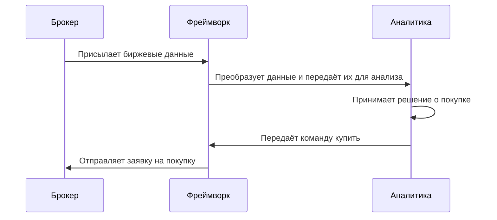

## Архитектура робота
В данной секции будут описаны модули Робота. В каждом описании можно найти:
- описания функций модуля для внешнего использования.
- описание того, как модуль взаимодействует с другими модулями, через процессы. В этих описаниях опущены детали работы других модулей и основная концентрация идёт на описываемый модуль.

### Планировщик
— центральный модуль программы, который вызывает функции, которые требуется вызывать регулярно (функции можно увидеть далее).

Для нормальной работы программы, нужно регулярно запускать определённые функции:
- [Фьючерсы](#фьючерсы).обновить_фьючерсы()
- [Свечи](#свечи).передать_свечи_аналитике()
- [Заявки](#заявки).отправить_заявки_из_очереди()
- [ХранилищеБиржевыхДанных](#хранилищебиржевыхданных).обновить_биржевые_данные()

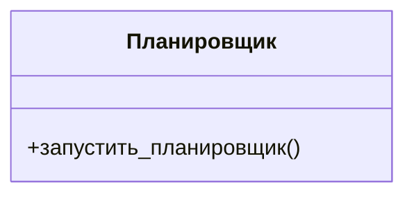

Публичные функции:
- запустить_планировщик() — функция, которая с определённой периодичностью бесконечно вызывает  функции, перечисленные выше.

Процесс работы:
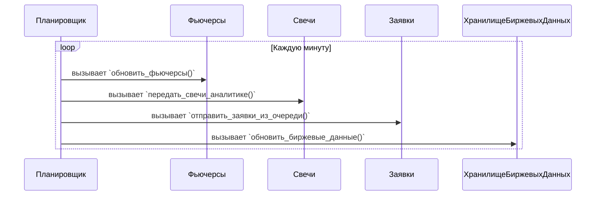

### ИнтерфейсАналитики
— модуль, через который фреймворк взаимодействует с аналитикой. 

`ИнтерфейсАналитики` нужен для того, чтобы фреймворк мог обращаться к функциям аналитики. Например, для того, чтобы передать свечи для обработки или передать ответы на заявки. 
<!-- Если модули фреймворка будут напрямую вызывать функции аналитики, то в программе связи внутри между аналитикой и фреймворком будут запутаны, поэтому были введены специальные интерфейсы: Аналитика может взаимодействовать с фреймворком —  -->

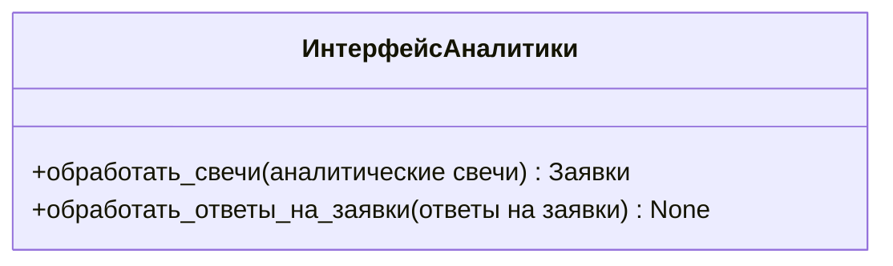

Описание функций для внешнего использования:
- +обработать_свечи() — передаёт [аналитические свечи](#термины) от фреймворка к аналитике.
- +обработать_ответы_на_заявки() — передаёт [ответы](#аналитическийответназаявку) на отправленные заявки от фреймворка к аналитике.

Процесс работы:
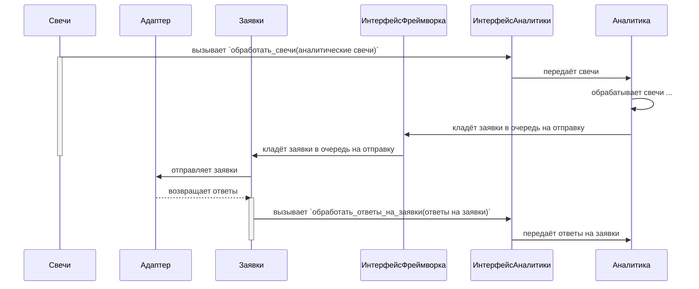

### ИнтерфейсФреймворка
— модуль, через который аналитика взаимодействует с фреймворком.

`ИнтерфейсАналитики` нужен для того, чтобы Аналитика могла обращаться к функциям Фреймворка. Например, для того, чтобы запросить свечи текущую стоимость портфеля.

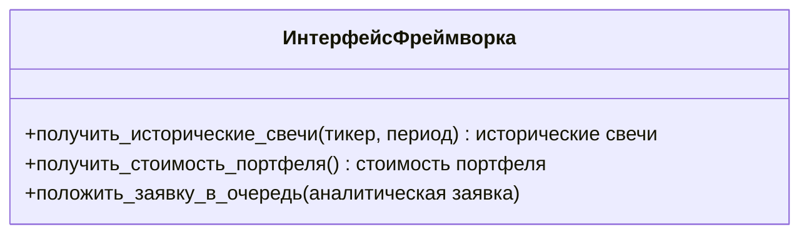

Описание функций для внешнего использования:
- получить_исторические_свечи() — возвращает массив с ценами закрытий за указанное количество дней.
- получить_стоимость_портфеля() — возвращает текущую стоимость портфеля
- положить_заявку_в_очередь() — кладёт [аналитическую заявку](#аналитическаязаявка) в очередь заявок на отправку на биржу.

Процесс работы:
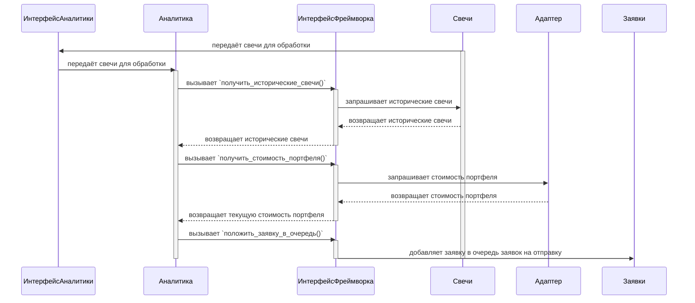

### Заявки
— модуль, отвечающий за отправку заявок из аналитики на биржу.

Для того, чтобы открывать позиции на бирже, нужно отправлять **заявки**. Заявки можно отправлять только в **торговое время**, в **неторговое время** заявки не принимаются. Неторговое время: 1. ночь (с 23:45 до 11:00) 2. клиринг (с 18:45 до 19:05), также неторговое время может наступить и в другие моменты, когда, например, потеряно соединение с биржей или возникли какие-то проблемы на стороне брокера, не позволяющие отправить заявку.

В связи с тем, что существует **неторговое время**, заявки отправляются не сразу, а сначала кладутся в **очередь заявок** с помощью функции `положить_заявку_в_очередь()`. Затем, если сейчас **торговое время**, в функции `отправить_заявки_из_очереди()` заявки из очереди отправляются на биржу. Также есть вероятность того, что нужно удалить все заявки из очереди, причины этого описаны в модуле [Свечи](#свечи).

Есть очень маленькая вероятность того, что ответ на заявку попросту не придёт. Такая ситуация может возникнуть в том случае, если, например, после отправки заявки Робот сразу же потерял соединение с брокером, так что ответ на заявку попросту не был принят. Чтобы понять, что заявка не была исполнена, нужно хранить все отправленные заявки, пока на них не пришёл ответ. Такие заявки хранятся в **отправленных заявках**. Также есть вероятность того, что нужно отозвать все отправленные заявки с биржи, в этом случае вызывается `снять_все_заявки_на_бирже`, причины данного события описаны в модуле [Свечи](#свечи).

Также, когда заявка исполнилась или отклонилась, биржа присылает **ответы на заявки**. Ответы на заявки должны быть переданы `Аналитике`. Обработка этих ответов и передача их в `Аналитику` происходит в `обработать_ответ_на_заявку()`. 

<!-- 
Важный нюанс: т.к. `Аналитика` должна получить ответы на все, отправленные ею заявку снять_все_заявки_на_бирже()` и `очистить_очередь_заявок` передача ответов -->

Внешний интерфейс
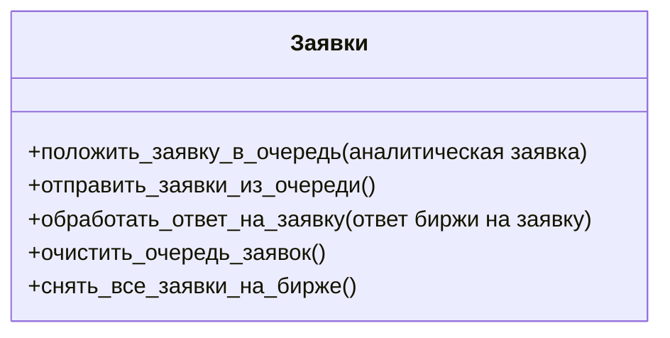

Описание функций для внешнего использования:
- положить_заявку_в_очередь() — кладёт [аналитическую заявку](#аналитическаязаявка) в очередь заявок
- отправить_заявки_из_очереди() — отправляет заявки из очереди заявок на биржу
- обработать_ответ_на_заявку() — преобразует ответ биржи на заявку в формат [аналитического ответа на заявку](#аналитическийответназаявку) и передаёт ответ в аналитику.
- очистить_очередь_заявок() — удаляет все заявки из очереди заявок. 
- снять_все_заявки_на_бирже() — снимает все заявки на бирже

Процесс работы:
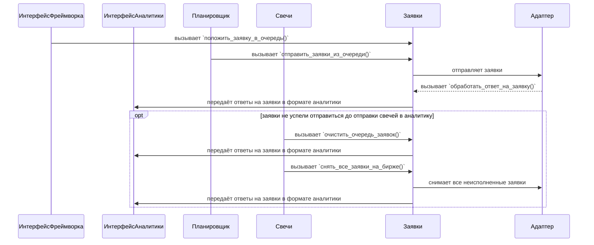

### Фьючерсы
— модуль, отвечающий за хранение и обновление информации о фьючерсах по тикерам.

На запуске программы робот загружает конфиг. В конфиге есть тикеры. Тикер — название базового актива фьючерса. Фьючерс — производная базового актива. По одному Тикеру существует множество Фьючерсов. Фьючерсы, в отличие от тикеров, имеют **дату экспирации**. После **даты экспирации** фьючерс больше не торгуется. Если Фьючерс ещё не закончился, то мы его называем **живым**. Одновременно по одному тикеру может быть несколько **живых** Фьючерсов, однако ликвиден всегда только один — фьючерс с ближайшей датой экспирации, мы его называем **активным**. **Однако** в день экспирации фьючерса он перестаёт быть активным, и активным становится следующий фьючерс с ближайшей датой экспирации. 

Отслеживаемые тикеры — тикеры, с которыми сейчас работает робот.
Отслеживаемые фьючерсы — фьючерсы по отслеживаемым тикерам, с которыми сейчас работает робот. По каждому тикеру может быть только один отслеживаемый фьючерс.
Текущий фьючерс — то же самое, что отслеживаемый фьючерс.

Модуль хранит у себя **отслеживаемые** (текущие) фьючерсы. Это фьючерсы, с которыми работает робот, т.е. те фьючерсы, по которым он получает свечи, запрашивает биржевые данные, отправляет заявки.

Задача модуля заключается в том, чтобы определять, какие фьючерсы сейчас активны, а также предоставлять данные об активных фьючерсах другим модулям.

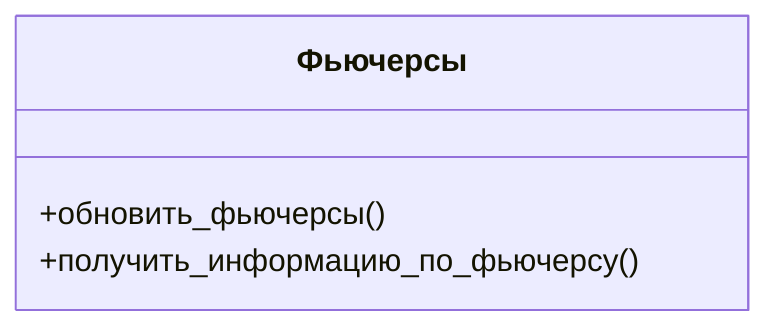

Описание функций для внешнего использования:
- обновить_фьючерсы() — определяет и сохраняет текущие фьючерсы по отслеживаемым тикерам.
- получить_информацию_по_фьючерсу(тикер) — возвращает информацию об **текущем** фьючерсе тикера.

Процесс работы:
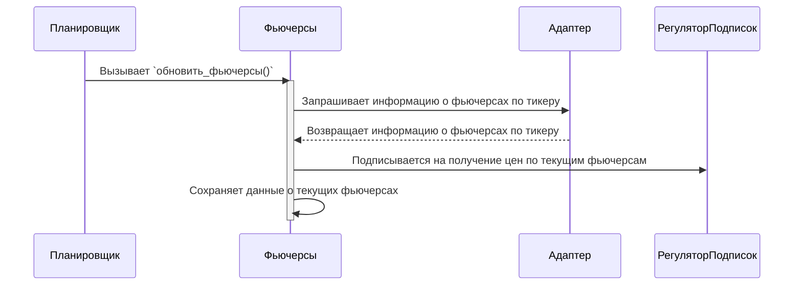

### Свечи
— модуль, отвечающий за формирование [аналитических свечей](#аналитическаясвеча) и поставку их в аналитику.

В аналитику нужно регулярно передавать свечи для обработки.

Свечи, которые робот получает от биржи, являются [сырыми](#сыраясвеча) и они не подходят для использования аналитикой. Перед тем, как передать свечи аналитике, нужно сделать определённые преобразования. После выполнения всех преобразований должна получиться [аналитическая свеча](#аналитическаясвеча).


Преобразовывать свечу из сырой в аналитическую надо в определённом порядке:
1. Определить сценарии, которые нужно выполнить. Если никаких сценариев не нужно выполнять, то свечи и не отправляются.
2. Если нужно выполнить сценарий, то в соответствие с требованием\* производится очистка очереди заявок и снятие заявок на бирже.
3. В зависимости от выбранного сценария запрашиваются свечи.  
   1. Если сценарий свечи — последняя свеча фьючерса, то запрашивается свеча фьючерса.
   2. В остальных случай запрашивается свеча текущего фьючерса.
4. В зависимости от фьючерса свечи, полученной в прошлом пункте, запрашиваем биржевые данные по нужному фьючерсу.
5. Запрашиваем индексы свечей

\*Есть требование, что перед отправкой свечей в `Аналитику` нужно удалить все заявки из очереди заявок и снять все заявки на бирже. Поэтому сразу после того, как определили сценарий, заявки из очереди заявок удаляются и все заявки на бирже снимаются.

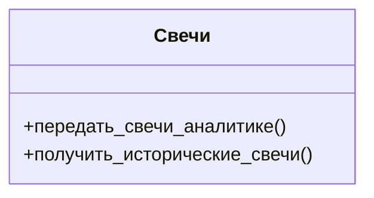

Описание функций для внешнего использования:
- передать_свечи_аналитике() — формирует и отправляет [аналитические свечи](#аналитическаясвеча) в аналитику. Здесь задаются значения всех атрибутов [аналитических свечей](#аналитическаясвеча).
- получить_исторические_свечи() — возвращает исторические свечи для аналитики.

Процесс работы:
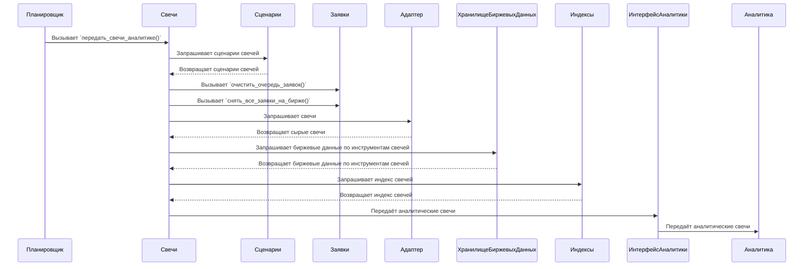
### Индексы
— модуль, отвечающий за индексы свечей, передаваемых в аналитику.

Индекс — атрибут [аналитической свечи](#аналитическаясвеча), идентифицирующий её среди других свечей по тикеру. 

В `Аналитику` свечи отправляются наборами. В каждом наборе находятся свечи по всем отслеживаемым инструментам. **У всех свечей в** таком **наборе** должен быть **одинаковый индекс**.

В основном `Аналитика` использует индексы в логировании. Например, чтобы указать, что такое-то событие произошло в такое-то время, используются индекс свечи, на которой произошло событие. Это не единственное использование индексов, однако самое основное.

Индексы свечей определяются по принципу... (пока неизвестно)

Модуль `Индексы` занимается тем, чтобы определять индексы свечей.
<!-- 
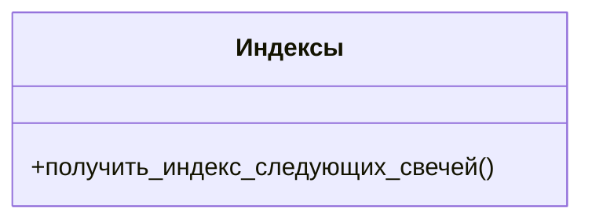
-->
Описание функций для внешнего использования:
- получить_индекс_следующих_свечей() — возвращает индекс свечей.

<!-- Требования:
- В `Аналитику` свечи отправляются наборами. В каждом наборе находятся свечи по всем отслеживаемым инструментам. **У всех свечей в** таком **наборе** должен быть **одинаковый индекс**.
- **Индекс может только увеличиваться**. Т.е. если в аналитику передана свеча с индексом 100, то в следующий индекс должен быть больше 100. -->

Процесс работы:
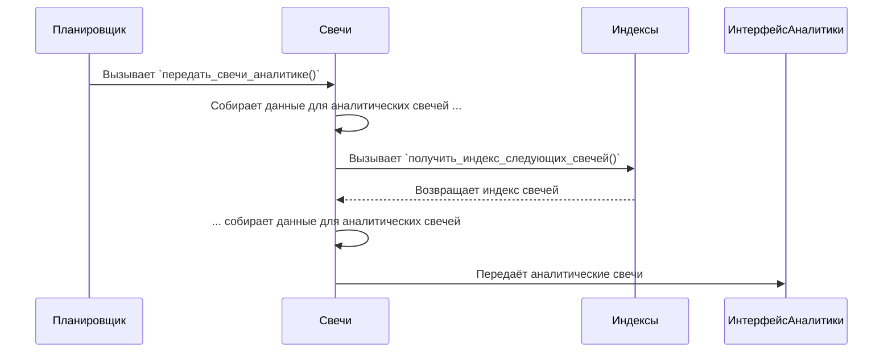

### Сценарии
— модуль, отвечающий за определение сценариев свечей. 

Сценарий — атрибут [аналитической свечи](#аналитическаясвеча), который определяет какие действия нужно выполнить со свечой.

Сценарии бывают следующие:
- NRL — нормальная свеча
- FF — первая свеча фьючерса
- LF — последняя свеча фьючерса

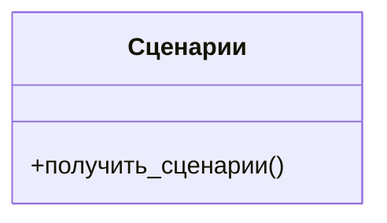

Описание функций для внешнего использования:
- получить_сценарии() — возвращает сценарии свечей.

Процесс работы:
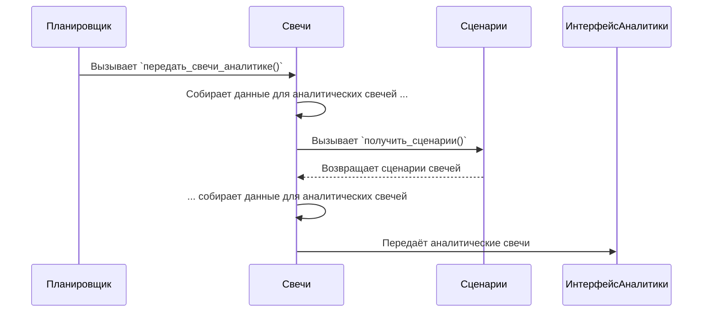

### ХранилищеБиржевыхДанных
— модуль, отвечающий за хранение и обновление биржевых данных. Формат биржевых данных описан [здесь](#биржевыеданные).

Биржевые данные — данные о фьючерсах, являющиеся атрибутами [аналитической свечи](#аналитическаясвеча).

Биржевые данные нужно обновлять после каждого клиринга (после 19:05).

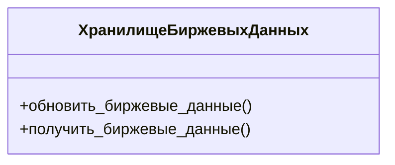
Описание функций для внешнего использования:
- обновить_биржевые_данные() — обновляет биржевые данные.
- получить_биржевые_данные() — возвращает биржевые данные.

Процесс работы:
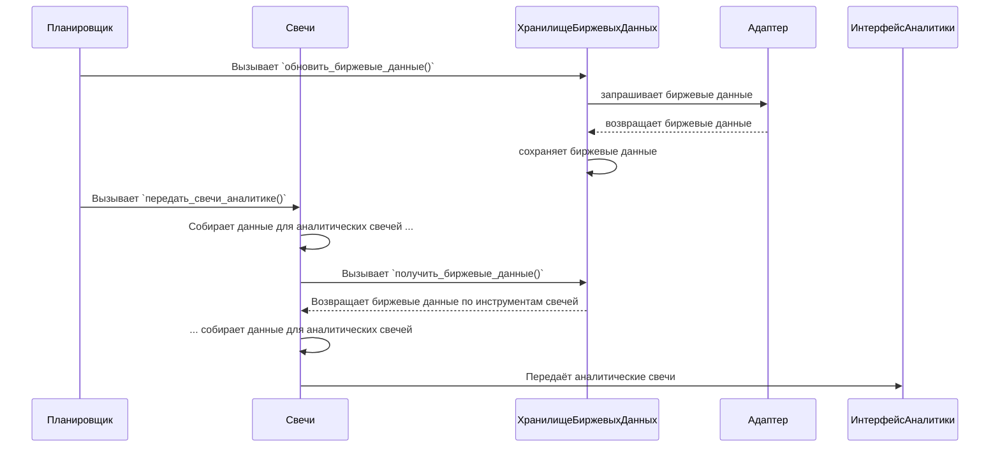
### РегуляторПодписок
— модуль, отвечающий за подписки на данные.

Чтобы брокер присылал роботу новые цены фьючерсов и ответы на заявки, нужно подписаться на получение этих данных. Данный модуль отвечает за все подписки.

Если соединения с брокером было потеряно, то при восстановлении соединения все подписки нужно возобновить.

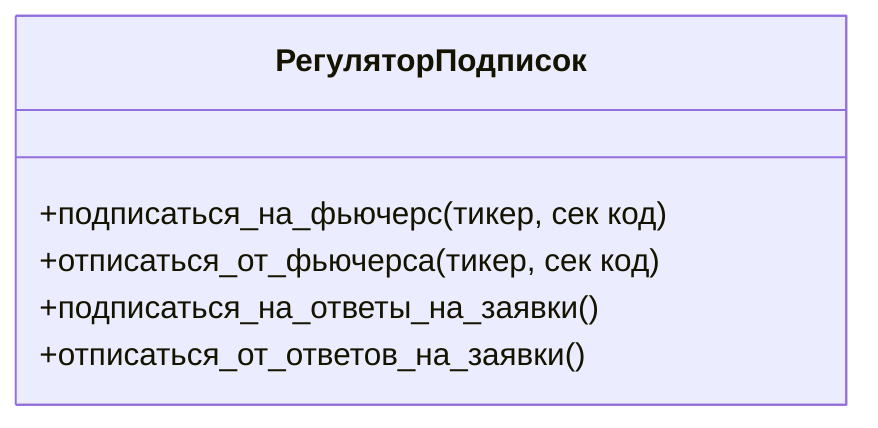

Описание функций для внешнего использования:
- подписаться_на_фьючерс() — подписывается на получение цен по фьючерсу
- отписаться_от_фьючерса() — отписывается от получения цен по фьючерсу
- подписаться_на_ответы_на_заявки() — подписывается на получение ответов на заявки
- отписаться_от_ответов_на_заявки() — отписывается от получения ответов на заявки

Процесс работы:
```mermaid
sequenceDiagram
  Планировщик->>Фьючерсы: Вызывает `обновить_фьючерсы()`
  activate Фьючерсы
  Фьючерсы->>Фьючерсы: Получает данные о текущих фьючерсах
  Фьючерсы->>РегуляторПодписок: Подписывается на получение цен по текущим фьючерсам
  РегуляторПодписок->>Адаптер: Отправляет запрос на подписку на цены фьючерсов
  Адаптер-->>РегуляторПодписок: Присылает подтверждение подписки
  Фьючерсы->>Фьючерсы: Сохраняет данные о текущих фьючерсах
  deactivate Фьючерсы
```

### Адаптер
— модуль отвечающий за коммуникацию с биржей. Он преобразует данные из биржи в формат, нужный аналитике, а данные от аналитики в формат биржи.


```mermaid
classDiagram
  class Адаптер{
    +подписаться_на_фьючерс(тикер, сек код)
    +отписаться_от_фьючерса(тикер, сек код)
    +подписаться_на_ответы_на_заявки()
    +отписаться_от_ответов_на_заявки()
    +получить_все_коллбеки()
    +получить_текущие_позиции() dict[код_фьючерса: количество_позиций]
    +отправить_заявку(аналитическая_заявка) 
    +получить_го(код_фьючерса) го
    +получить_стоимость_шага(код_фьючерса) стоимость_шага
    +можно_ли_сейчас_торговать(код_фьючерса) True/False
    +получить_стоимость_портфеля() стоимость_портфеля
    +получить_информацию_о_фьючерсах(тикер) информация_о_фьючерсах
  }
```

## Структуры данных
### СыраяСвеча
— формат свеч, получаемых от биржи.

| Тип атрибута | Название атрибута | Значение атрибута                                                |
|--------------|-------------------|------------------------------------------------------------------|
| date         | дата              | дата свечи                                                       |
| float        | цена              | цена закрытия свечи                                              |
| str          | код               | код фьючерса свечи                                               |
| str          | тикер             | тикер                                                            |

### АналитическаяСвеча
— формат свечи для отправки в `Аналитику`.

| Тип атрибута | Название атрибута | Значение атрибута                                                |
|--------------|-------------------|------------------------------------------------------------------|
| date         | дата              | дата свечи                                                       |
| int          | индекс            | число, идентифицирующее свечу среди других свечей по тикеру      |
| float        | цена              | цена закрытия свечи                                              |
| str          | код               | код фьючерса свечи                                               |
| str          | сценарий          | сценарий свечи, который нужно выполнить в аналитике              |
| str          | тикер             | тикер                                                            |
| float        | го                | текущее ГО                                                       |
| float        | расчётная_цена    | текущая расчётная цена                                           |
| float        | стоимость_шага    | текущая стоимость шага                                           |

Атрибут `сценарий` может быть равен:
- NRL — нормальная свеча
- FF — первая свеча фьючерса
- LF — последняя свеча фьючерса

`сценарий` определяет какие действия требуется выполнить со свечой в аналитике.
### АналитическаяЗаявка
| Тип атрибута | Название атрибута | Значение атрибута                                       |
|--------------|-------------------|---------------------------------------------------------|
| str          | тикер             | тикер                                                   |
| str          | направление       | направление заявки (либо "B" покупка, либо "S" продажа) |
| int          | количество        | количество лотов в заявке                               |
### АналитическийОтветНаЗаявку
| Тип атрибута | Название атрибута | Значение атрибута                                       |
|--------------|-------------------|---------------------------------------------------------|
| str          | тикер             | тикер                                                   |
| str          | направление       | направление заявки (либо "B" покупка, либо "S" продажа) |
| int          | количество        | количество исполненных лотов                            |
### Фьючерс
Формат, в котором хранится информация о фьючерсе:
| Тип атрибута | Название атрибута | Значение атрибута        |
|--------------|-------------------|--------------------------|
| str          | тикер             | тикер                    |
| str          | код               | код фьючерса             |
| date         | дата_экспирации   | дата экспирации фьючерса |
### БиржевыеДанные
| Тип атрибута | Название атрибута | Значение атрибута |
|--------------|-------------------|-------------------|
| float        | го                | ГО                |
| float        | расчётная_цена    | расчётная цена    |
| float        | стоимость_шага    | стоимость шага    |
