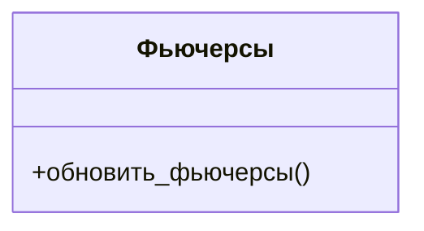
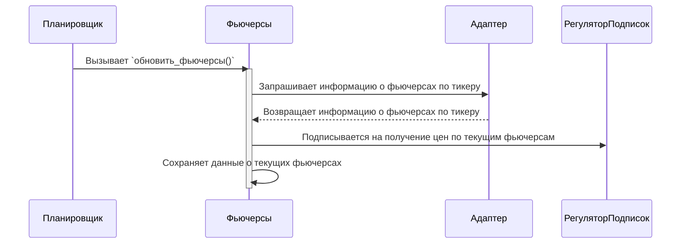

Если бы я писал логический уровень не для себяч, а для командды разработчиков, и моя цель была бы описать модули так, чтобы их можно было поручить каждому отдельному человеку. Как бы я сделал логический уровень?

1. Описал бы цели каждого модуля
2. Описал бы интерфейс каждого модуля
   1. Описал бы вход и выход

### Фьючерсы
— модуль, отвечающий за хранение и обновление информации о фьючерсах по тикерам.

На запуске программы робот загружает конфиг. В конфиге есть тикеры. Тикер — название базового актива фьючерса. Фьючерс — производная базового актива. По одному Тикеру существует множество Фьючерсов. Фьючерсы, в отличие от тикеров, имеют **дату экспирации**. После **даты экспирации** фьючерс больше не торгуется. Если Фьючерс ещё не закончился, то мы его называем **живым**. Одновременно по одному тикеру может быть несколько **живых** Фьючерсов, однако ликвиден всегда только один — фьючерс с ближайшей датой экспирации, мы его называем **активным**. 

Модуль хранит у себя **отслеживаемые** (текущие) фьючерсы. Это фьючерсы, с которыми работает робот, т.е. те фьючерсы, по которым он получает свечи, запрашивает биржевые данные, отправляет заявки. 

При обновлении этих фьючерсов, они заменяются на **активные**. Например:
1. 

Отслеживаемые тикеры — тикеры, с которыми сейчас работает робот. 
Отслеживаемые фьючерсы — фьючерсы по отслеживаемым тикерам, с которыми сейчас работает робот. 

По отслеживаемым фьючерсам робот получает свечи и запрашивает биржевые данные.

Задача модуля заключается в том, чтобы определять, какие фьючерсы сейчас активны, а также предоставлять данные об активных фьючерсах другим модулям. Для выполнения этих задач модуль должен иметь следующие функции:
- обновить_фьючерсы() — определяет и сохраняет текущие фьючерсы по отслеживаемым тикерам.
  - Во время выполнения это функции заканчивающиеся фьючерсы заменяются активными.
- получить_информацию_по_фьючерсу(тикер) — возвращает информацию об **текущем** фьючерсе тикера.

Описание функций для внешнего использования:
- обновить_фьючерсы() — обновляет информацию о текущих фьючерсах: если у фьючерса настала дата экспирации, то заменяет его на актуальный фьючерс.

Процесс работы:

